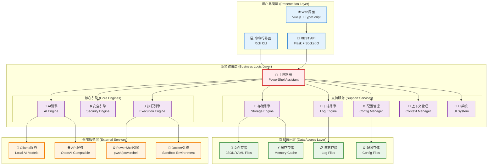
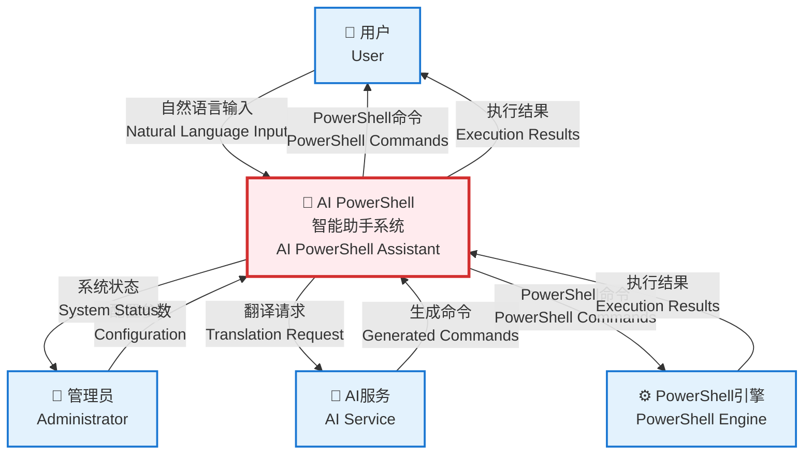
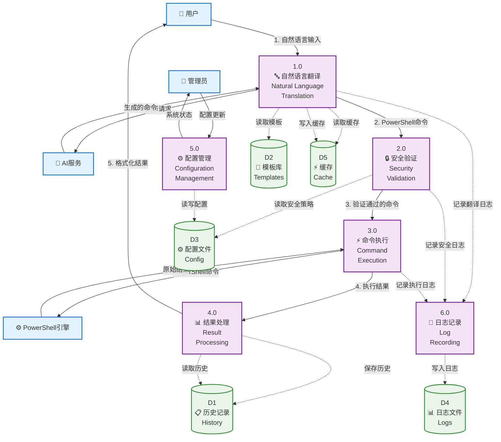
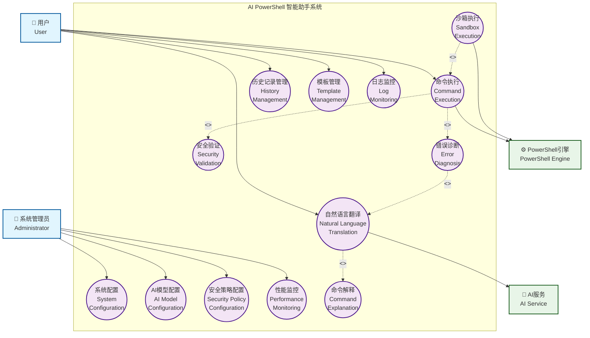

<!-- 文档类型: 开发者文档 | 最后更新: 2025-10-17 | 维护者: 项目团队 -->

# AI PowerShell 智能助手 - 系统架构

---
📍 [首页](../README.md) > [文档中心](README.md) > 系统架构文档

## 📋 目录

- [系统概述](#系统概述)
- [整体架构](#整体架构)
- [核心模块详解](#核心模块详解)
- [数据流](#数据流)
- [设计模式](#设计模式)
- [扩展点](#扩展点)
- [技术栈](#技术栈)
- [性能优化](#性能优化)
- [安全考虑](#安全考虑)
- [测试策略](#测试策略)
- [部署架构](#部署架构)

---

## 系统概述

AI PowerShell 智能助手是一个基于本地 AI 模型的智能命令行助手，采用模块化架构设计，支持中文自然语言交互，提供三层安全保护机制。

### 设计目标

1. **模块化**: 采用高内聚低耦合的模块化架构，便于维护和扩展
2. **简洁性**: 提供简单易用的用户界面和清晰的代码结构
3. **安全性**: 实施三层安全保护，确保命令执行的安全性
4. **隐私保护**: 所有 AI 处理在本地进行，不上传用户数据
5. **跨平台**: 支持 Windows、Linux 和 macOS
6. **可扩展性**: 支持添加自定义规则和集成不同的 AI 模型

### 核心特性

- 中文自然语言到 PowerShell 命令的智能转换
- 基于规则匹配和 AI 模型的混合翻译策略
- 模块化架构设计，高内聚低耦合
- 三层安全验证：命令白名单、权限检查、沙箱执行
- 跨平台 PowerShell 支持（PowerShell 5.1 和 PowerShell Core）
- 完整的审计日志和性能监控
- 本地 AI 模型集成（LLaMA、Ollama 等）
- 会话管理和命令历史记录
- 上下文感知的智能翻译

---

## 整体架构

### 架构层次图

```
┌─────────────────────────────────────────────────────────────┐
│                    用户接口层 (User Interface)                │
│  ┌─────────────┬─────────────┬─────────────────────────────┐ │
│  │ 命令行界面   │  交互模式    │  Python API                 │ │
│  │   (CLI)     │ (Interactive)│  (API)                      │ │
│  └─────────────┴─────────────┴─────────────────────────────┘ │
└─────────────────────────────────────────────────────────────┘
                            │
                            ▼
┌─────────────────────────────────────────────────────────────┐
│                  核心处理层 (Core Processing)                 │
│  ┌──────────────────────────────────────────────────────┐   │
│  │           PowerShellAssistant (主控制器)              │   │
│  │  - 协调各组件工作                                      │   │
│  │  - 管理请求处理流程                                    │   │
│  │  - 提供统一的接口                                      │   │
│  └──────────────────────────────────────────────────────┘   │
└─────────────────────────────────────────────────────────────┘
                            │
        ┌───────────────────┼───────────────────┐
        ▼                   ▼                   ▼
┌──────────────┐   ┌──────────────┐   ┌──────────────┐
│  AI 引擎      │   │  安全引擎     │   │  执行引擎     │
│ (AI Engine)  │   │(Security Eng.)│   │(Exec Engine) │
└──────────────┘   └──────────────┘   └──────────────┘
        │                   │                   │
        └───────────────────┼───────────────────┘
                            ▼
┌─────────────────────────────────────────────────────────────┐
│                   支持模块层 (Support Modules)                │
│  ┌─────────────┬─────────────┬─────────────┬─────────────┐   │
│  │  配置管理    │  日志引擎    │  存储引擎    │  上下文管理  │   │
│  │  (Config)   │  (Logging)  │  (Storage)  │  (Context)  │   │
│  └─────────────┴─────────────┴─────────────┴─────────────┘   │
└─────────────────────────────────────────────────────────────┘
```

### 模块化架构

项目采用高内聚低耦合的模块化架构设计：

**架构特点**:
- 清晰的模块划分，每个模块职责单一
- 模块间通过接口通信，降低耦合
- 支持多种 AI 模型集成
- 完整的三层安全保护
- 沙箱执行支持
- 完整的日志和审计系统

**模块结构**:
```
src/
├── interfaces/          # 接口定义层
│   └── base.py         # 基础接口和数据模型
├── ai_engine/          # AI 引擎模块
│   ├── engine.py       # AI 引擎主类
│   ├── translation.py  # 翻译逻辑
│   ├── providers.py    # AI 提供商
│   └── error_detection.py  # 错误检测
├── security/           # 安全引擎模块
│   ├── engine.py       # 安全引擎主类
│   ├── whitelist.py    # 命令白名单
│   ├── permissions.py  # 权限检查
│   └── sandbox.py      # 沙箱执行
├── execution/          # 执行引擎模块
│   ├── executor.py     # 执行器主类
│   ├── platform_adapter.py  # 平台适配
│   └── output_formatter.py  # 输出格式化
├── config/             # 配置管理模块
│   ├── manager.py      # 配置管理器
│   └── models.py       # 配置数据模型
├── log_engine/         # 日志引擎模块
│   ├── engine.py       # 日志引擎主类
│   ├── decorators.py   # 日志装饰器
│   └── filters.py      # 日志过滤器
├── storage/            # 存储引擎模块
│   ├── interfaces.py   # 存储接口
│   ├── file_storage.py # 文件存储实现
│   └── factory.py      # 存储工厂
├── context/            # 上下文管理模块
│   ├── manager.py      # 上下文管理器
│   ├── history.py      # 历史记录
│   └── models.py       # 上下文数据模型
└── main.py             # 主入口文件
```

---

## 核心模块详解

### 1. 主控制器 (PowerShellAssistant)

**位置**: `src/main.py`

**职责**: 系统核心，协调所有模块工作，管理请求处理流程

**核心功能**:
- 初始化和管理所有子模块
- 处理用户请求的完整流程
- 提供交互式和命令行两种使用模式
- 会话生命周期管理

**初始化流程**:
```python
def __init__(self, config_path: Optional[str] = None):
    # 1. 加载配置
    self.config_manager = ConfigManager(config_path)
    self.config = self.config_manager.load_config()
    
    # 2. 初始化日志引擎
    self.log_engine = LogEngine(self.config.logging)
    
    # 3. 初始化存储引擎
    self.storage = StorageFactory.create_storage(...)
    
    # 4. 初始化上下文管理器
    self.context_manager = ContextManager(storage=self.storage)
    
    # 5. 初始化 AI 引擎
    self.ai_engine = AIEngine(self.config.ai.model_dump())
    
    # 6. 初始化安全引擎
    self.security_engine = SecurityEngine(self.config.security.model_dump())
    
    # 7. 初始化执行引擎
    self.executor = CommandExecutor(self.config.execution.model_dump())
```

**关键方法**:
- `process_request()`: 处理用户请求的完整流程
- `interactive_mode()`: 启动交互式命令行界面
- `_build_context()`: 构建当前上下文
- `_get_user_confirmation()`: 获取用户确认

**特点**:
- 依赖注入模式，各模块松耦合
- 完整的错误处理和日志记录
- 支持自动执行和用户确认两种模式
- 使用关联 ID 追踪请求生命周期

---

### 2. 接口定义层 (Interfaces)

**位置**: `src/interfaces/`

**职责**: 定义所有模块间的接口和数据模型

**核心接口**:
- `AIEngineInterface`: AI 引擎接口
- `SecurityEngineInterface`: 安全引擎接口
- `ExecutorInterface`: 执行器接口
- `StorageInterface`: 存储接口

**数据模型**:
- `Suggestion`: 命令建议
- `ValidationResult`: 验证结果
- `ExecutionResult`: 执行结果
- `Context`: 上下文信息
- `CommandEntry`: 命令历史条目
- `Session`: 会话信息

**设计原则**:
- 使用抽象基类定义接口
- 数据类使用 `@dataclass` 装饰器
- 类型提示确保类型安全
- 接口与实现分离

---

### 3. AI 引擎 (AI Engine)

**位置**: `src/ai_engine/`

**职责**: 将中文自然语言转换为 PowerShell 命令

**组件**:
- `engine.py`: AI 引擎主类，协调翻译流程
- `translation.py`: 翻译逻辑和规则匹配
- `providers.py`: AI 提供商（LLaMA、Ollama 等）
- `error_detection.py`: 错误检测和修正

**工作流程**:
1. 接收用户的自然语言输入
2. 检查缓存是否有匹配结果
3. 尝试规则匹配（快速路径）
4. 如果规则匹配失败，使用 AI 模型生成
5. 错误检测和修正
6. 缓存结果并返回

**特点**:
- 规则匹配和 AI 模型结合
- 支持多种 AI 提供商
- 上下文感知
- 置信度评分
- 缓存机制

**支持的 AI 提供商**:
- Local: 本地 LLaMA 模型
- Ollama: Ollama 服务
- OpenAI: OpenAI API
- Azure: Azure OpenAI

---

### 4. 安全引擎 (Security Engine)

**位置**: `src/security/`

**职责**: 三层安全验证和沙箱执行

**组件**:
- `engine.py`: 安全引擎主类，协调三层验证
- `whitelist.py`: 命令白名单验证
- `permissions.py`: 权限检查和确认
- `sandbox.py`: Docker 沙箱执行

**三层安全架构**:

```
第一层：命令白名单验证
  ├─ 检查危险命令模式（30+ 种）
  ├─ 识别安全命令前缀
  └─ 风险等级评估
         │
         ▼
第二层：权限检查
  ├─ 检测管理员权限需求
  ├─ 用户确认流程
  └─ 权限提升日志
         │
         ▼
第三层：沙箱执行（可选）
  ├─ Docker 容器隔离
  ├─ 资源限制
  └─ 网络隔离
```

**风险等级**:
- `SAFE`: 安全命令（Get-*, Show-*, Test-* 等）
- `LOW`: 低风险命令
- `MEDIUM`: 中等风险（需要确认）
- `HIGH`: 高风险（需要管理员权限或特别危险）
- `CRITICAL`: 严重风险（可能造成系统损坏）

**危险命令类别**:
- 文件系统危险操作（递归删除、格式化磁盘等）
- 系统控制（关机、重启等）
- 注册表操作
- 网络和防火墙配置
- 进程和任务管理
- 用户和权限管理
- 脚本执行策略
- 远程代码下载和执行

**沙箱特性**:
- 内存限制: 默认 512MB
- CPU 限制: 默认 0.5 核心
- 网络隔离: 可选禁用网络
- 只读文件系统: 防止文件修改
- 进程数限制: 最多 100 个进程
- 安全选项: `no-new-privileges`

**特点**:
- 可配置的安全规则
- 智能风险评估
- 完整审计日志
- 沙箱隔离支持
- 跨平台权限检查

---

### 5. 执行引擎 (Execution Engine)

**位置**: `src/execution/`

**职责**: 跨平台 PowerShell 命令执行

**组件**:
- `executor.py`: 执行器主类
- `platform_adapter.py`: 平台适配器
- `output_formatter.py`: 输出格式化

**工作流程**:
1. 接收待执行的 PowerShell 命令
2. 平台检测和适配
3. 执行命令并捕获输出
4. 格式化输出结果
5. 错误处理和日志记录

**特点**:
- 自动平台检测（Windows/Linux/macOS）
- PowerShell 版本自动选择
- 中文编码支持
- 超时控制
- 输出格式化
- 返回码处理

**平台支持**:
- Windows: PowerShell 5.1 / PowerShell Core
- Linux: PowerShell Core
- macOS: PowerShell Core

---

### 6. 配置管理 (Configuration Management)

**位置**: `src/config/`

**职责**: 系统配置和验证

**组件**:
- `manager.py`: 配置管理器
- `models.py`: 配置数据模型（使用 Pydantic）

**配置模型**:

#### AIConfig - AI 引擎配置
- `provider`: AI 提供商 (local, ollama, openai, azure)
- `model_name`: AI 模型名称
- `temperature`: 生成温度 (0.0-2.0)
- `max_tokens`: 最大生成 token 数 (1-4096)
- `cache_enabled`: 是否启用翻译缓存
- `cache_size`: 缓存大小

#### SecurityConfig - 安全引擎配置
- `sandbox_enabled`: 是否启用沙箱执行
- `require_confirmation`: 是否需要用户确认
- `whitelist_mode`: 白名单模式 (strict, moderate, permissive)
- `dangerous_patterns`: 危险命令模式列表
- `safe_prefixes`: 安全命令前缀列表
- `custom_rules`: 自定义安全规则

#### ExecutionConfig - 执行引擎配置
- `timeout`: 命令执行超时时间 (1-300 秒)
- `encoding`: 输出编码格式
- `platform`: 平台类型 (auto, windows, linux, macos)
- `powershell_path`: PowerShell 可执行文件路径
- `auto_detect_powershell`: 是否自动检测 PowerShell

#### LoggingConfig - 日志配置
- `level`: 日志级别 (DEBUG, INFO, WARNING, ERROR, CRITICAL)
- `file`: 日志文件路径
- `max_size`: 日志文件最大大小
- `backup_count`: 日志文件备份数量
- `format`: 日志格式
- `console_output`: 是否输出到控制台

#### StorageConfig - 存储配置
- `base_path`: 存储基础路径
- `history_file`: 历史记录文件名
- `config_file`: 配置文件名
- `cache_dir`: 缓存目录名
- `max_history_size`: 最大历史记录数量

#### ContextConfig - 上下文管理配置
- `max_context_depth`: 最大上下文深度 (1-50)
- `session_timeout`: 会话超时时间 (≥60 秒)
- `enable_learning`: 是否启用学习功能

**配置层级**:
- 默认配置（`config/default.yaml`）
- 用户配置（`~/.ai-powershell/config.yaml`）
- 环境变量覆盖
- 命令行参数覆盖

**核心方法**:
- `load_config()`: 从文件加载配置
- `save_config()`: 保存配置到文件
- `update_config()`: 更新配置（深度合并）
- `validate_config()`: 验证配置数据
- `reset_to_defaults()`: 重置为默认配置

**特点**:
- YAML 配置文件
- Pydantic 数据验证
- 默认值支持
- 配置热重载
- 类型安全

---

### 7. 日志引擎 (Logging Engine)

**位置**: `src/log_engine/`

**职责**: 全面的审计跟踪和性能监控

**组件**:
- `engine.py`: 日志引擎主类
- `decorators.py`: 日志装饰器
- `filters.py`: 日志过滤器

**日志类型**:
- 用户请求日志
- AI 翻译日志
- 安全验证日志
- 命令执行日志
- 性能监控日志

**特点**:
- 结构化日志（JSON 格式）
- 关联追踪（Correlation ID）
- 敏感信息过滤
- 多种输出目标
- 日志轮转
- 性能监控

**日志级别**:
- DEBUG: 详细调试信息
- INFO: 一般信息
- WARNING: 警告信息
- ERROR: 错误信息
- CRITICAL: 严重错误

---

### 8. 存储引擎 (Storage Engine)

**位置**: `src/storage/`

**职责**: 数据持久化和历史记录管理

**组件**:
- `interfaces.py`: 存储接口定义
- `file_storage.py`: 文件存储实现
- `factory.py`: 存储工厂

**存储接口方法**:
- `save_history()` / `load_history()`: 历史记录管理
- `save_config()` / `load_config()`: 配置管理
- `save_cache()` / `load_cache()`: 缓存管理（支持 TTL）
- `save_session()` / `load_session()`: 会话管理
- `save_snapshot()` / `load_snapshot()`: 快照管理
- `save_user_preferences()` / `load_user_preferences()`: 用户偏好
- `get_storage_info()`: 获取存储信息

**文件存储结构**:
```
~/.ai-powershell/
├── sessions/           # 会话数据
│   ├── {session_id}.json
│   └── ...
├── snapshots/          # 上下文快照
│   ├── {snapshot_id}.json
│   └── ...
├── preferences/        # 用户偏好
│   ├── {user_id}.json
│   └── ...
├── history.json        # 命令历史
├── config.yaml         # 配置文件
└── cache/             # 缓存数据
    ├── key1.json
    └── key2.json
```

**特点**:
- 使用 JSON 格式存储历史记录
- 使用 YAML 格式存储配置
- 支持缓存过期时间（TTL）
- 自动创建必要的目录结构
- 工厂模式支持多种存储后端

**支持的存储类型**:
- `file`: 文件存储（已实现）
- `memory`: 内存存储（待实现）
- `database`: 数据库存储（待实现）

---

### 9. 上下文管理 (Context Management)

**位置**: `src/context/`

**职责**: 会话管理、命令历史记录和用户偏好设置

**组件**:
- `manager.py`: 上下文管理器
- `history.py`: 历史记录管理器
- `models.py`: 上下文数据模型

**数据模型**:

#### CommandEntry - 命令历史条目
```python
@dataclass
class CommandEntry:
    command_id: str              # 命令唯一标识
    user_input: str              # 用户原始输入
    translated_command: str      # 翻译后的命令
    status: CommandStatus        # 命令状态
    output: str                  # 命令输出
    error: str                   # 错误信息
    return_code: int             # 返回码
    execution_time: float        # 执行时间
    confidence_score: float      # AI 翻译置信度
    timestamp: datetime          # 时间戳
    metadata: Dict[str, Any]     # 额外元数据
```

#### Session - 会话
```python
@dataclass
class Session:
    session_id: str              # 会话唯一标识
    user_id: Optional[str]       # 用户 ID
    status: SessionStatus        # 会话状态
    start_time: datetime         # 会话开始时间
    last_activity: datetime      # 最后活动时间
    end_time: Optional[datetime] # 会话结束时间
    working_directory: str       # 工作目录
    environment_vars: Dict       # 环境变量
    command_history: List[CommandEntry]  # 命令历史
    metadata: Dict[str, Any]     # 额外元数据
```

**ContextManager 核心功能**:
- 会话管理（开始、切换、终止）
- 命令管理（添加、更新、查询）
- 上下文查询
- 快照管理
- 用户偏好管理
- 统计信息

**HistoryManager 核心功能**:
- 基础操作（添加、删除、清空）
- 搜索和过滤
- 统计分析
- 导出和导入（JSON/CSV）

**特点**:
- 会话缓存，避免频繁磁盘 I/O
- 可配置的历史记录数量上限
- 支持批量保存
- 延迟加载
- 自动清理过期会话

---

## 数据流

### 完整请求处理流程

```
用户输入
   │
   ▼
┌─────────────────────┐
│  主控制器接收请求    │
│  PowerShellAssistant │
│  - 生成关联 ID       │
│  - 记录请求日志      │
└─────────────────────┘
   │
   ▼
┌─────────────────────┐
│  构建上下文          │
│  - 获取当前会话      │
│  - 获取命令历史      │
│  - 获取工作目录      │
└─────────────────────┘
   │
   ▼
┌─────────────────────┐
│  AI 引擎翻译        │
│  - 检查缓存          │
│  - 规则匹配          │
│  - AI 模型生成       │
│  - 错误检测          │
│  - 置信度评分        │
└─────────────────────┘
   │
   ▼
┌─────────────────────┐
│  安全引擎验证        │
│  第一层：白名单检查  │
│  - 危险命令检测      │
│  - 风险等级评估      │
└─────────────────────┘
   │
   ▼
┌─────────────────────┐
│  第二层：权限检查    │
│  - 管理员权限检测    │
│  - 权限提升日志      │
└─────────────────────┘
   │
   ▼
┌─────────────────────┐
│  第三层：沙箱执行    │
│  （可选）            │
│  - Docker 容器隔离   │
│  - 资源限制          │
└─────────────────────┘
   │
   ▼
┌─────────────────────┐
│  用户确认            │
│  - 显示生成的命令    │
│  - 显示风险信息      │
│  - 等待用户确认      │
└─────────────────────┘
   │
   ▼
┌─────────────────────┐
│  执行引擎执行        │
│  - 平台适配          │
│  - 命令执行          │
│  - 输出捕获          │
│  - 错误处理          │
└─────────────────────┘
   │
   ▼
┌─────────────────────┐
│  结果处理            │
│  - 输出格式化        │
│  - 日志记录          │
│  - 历史保存          │
│  - 上下文更新        │
└─────────────────────┘
   │
   ▼
返回结果给用户
```

### 模块间数据流

```
┌──────────────┐
│  用户输入     │
└──────┬───────┘
       │
       ▼
┌──────────────┐     Context      ┌──────────────┐
│ 主控制器      │ ◄──────────────  │ 上下文管理器  │
└──────┬───────┘                  └──────────────┘
       │
       │ 自然语言 + Context
       ▼
┌──────────────┐     Cache        ┌──────────────┐
│  AI 引擎      │ ◄──────────────► │  存储引擎     │
└──────┬───────┘                  └──────────────┘
       │
       │ Suggestion
       ▼
┌──────────────┐     Rules        ┌──────────────┐
│  安全引擎     │ ◄──────────────  │  配置管理     │
└──────┬───────┘                  └──────────────┘
       │
       │ ValidationResult
       ▼
┌──────────────┐     Logs         ┌──────────────┐
│  执行引擎     │ ────────────────►│  日志引擎     │
└──────┬───────┘                  └──────────────┘
       │
       │ ExecutionResult
       ▼
┌──────────────┐     History      ┌──────────────┐
│ 主控制器      │ ────────────────►│ 历史管理器    │
└──────────────┘                  └──────────────┘
```

---

## 设计模式

### 1. 依赖注入 (Dependency Injection)

所有模块通过构造函数注入依赖，降低耦合度：

```python
class PowerShellAssistant:
    def __init__(self, config_path: Optional[str] = None):
        # 注入配置管理器
        self.config_manager = ConfigManager(config_path)
        
        # 注入日志引擎
        self.log_engine = LogEngine(self.config.logging)
        
        # 注入存储引擎
        self.storage = StorageFactory.create_storage(...)
        
        # 注入其他依赖
        self.context_manager = ContextManager(storage=self.storage)
        self.ai_engine = AIEngine(self.config.ai.model_dump())
        self.security_engine = SecurityEngine(self.config.security.model_dump())
        self.executor = CommandExecutor(self.config.execution.model_dump())
```

**优点**:
- 便于单元测试（可注入 Mock 对象）
- 提高代码可维护性
- 降低模块间耦合

### 2. 工厂模式 (Factory Pattern)

存储引擎使用工厂模式创建实例：

```python
class StorageFactory:
    @staticmethod
    def create_storage(storage_type: str = "file", config: Dict = None) -> StorageInterface:
        if storage_type == "file":
            return FileStorage(config)
        elif storage_type == "memory":
            return MemoryStorage(config)
        elif storage_type == "database":
            return DatabaseStorage(config)
        else:
            raise ValueError(f"Unknown storage type: {storage_type}")
    
    @staticmethod
    def get_default_storage() -> StorageInterface:
        return StorageFactory.create_storage("file")
```

**优点**:
- 统一的创建接口
- 支持多种存储后端
- 实例缓存机制
- 便于扩展

### 3. 策略模式 (Strategy Pattern)

AI 引擎支持多种 AI 提供商：

```python
class AIEngine:
    def __init__(self, config: Dict):
        self.provider = self._create_provider(config['provider'])
    
    def _create_provider(self, provider_type: str) -> AIProvider:
        if provider_type == "local":
            return LocalProvider()
        elif provider_type == "ollama":
            return OllamaProvider()
        elif provider_type == "openai":
            return OpenAIProvider()
        # ...
```

**优点**:
- 灵活切换 AI 提供商
- 易于添加新的提供商
- 运行时动态选择

### 4. 装饰器模式 (Decorator Pattern)

日志引擎提供装饰器用于方法日志记录：

```python
@log_execution
def process_request(self, user_input: str) -> ExecutionResult:
    # 方法实现
    pass
```

**优点**:
- 非侵入式日志记录
- 代码复用
- 关注点分离

### 5. 单例模式 (Singleton Pattern)

配置管理器和日志引擎使用单例模式：

```python
class ConfigManager:
    _instance = None
    
    def __new__(cls, *args, **kwargs):
        if cls._instance is None:
            cls._instance = super().__new__(cls)
        return cls._instance
```

**优点**:
- 全局唯一实例
- 避免重复初始化
- 节省资源

### 6. 观察者模式 (Observer Pattern)

上下文管理器支持事件监听：

```python
class ContextManager:
    def __init__(self):
        self._listeners = []
    
    def add_listener(self, listener):
        self._listeners.append(listener)
    
    def _notify_listeners(self, event):
        for listener in self._listeners:
            listener.on_event(event)
```

**优点**:
- 解耦事件源和事件处理
- 支持多个监听器
- 易于扩展

### 7. 模板方法模式 (Template Method Pattern)

安全引擎的三层验证流程：

```python
class SecurityEngine:
    def validate_command(self, command: str, context: Context) -> ValidationResult:
        # 模板方法定义验证流程
        result = self._layer1_whitelist_check(command)
        if not result.is_valid:
            return result
        
        result = self._layer2_permission_check(command)
        if not result.is_valid:
            return result
        
        result = self._layer3_sandbox_check(command)
        return result
```

**优点**:
- 定义算法骨架
- 子步骤可灵活实现
- 保证流程一致性

---

## 扩展点

系统设计了多个扩展点，便于功能扩展和定制：

### 1. 添加新的 AI 提供商

继承 `AIProvider` 抽象基类并实现接口：

```python
from src.ai_engine.providers import AIProvider

class CustomAIProvider(AIProvider):
    def generate(self, prompt: str, context: Context) -> str:
        # 实现自定义 AI 生成逻辑
        pass
    
    def is_available(self) -> bool:
        # 检查提供商是否可用
        pass
```

在配置中注册：
```yaml
ai:
  provider: custom
  model_name: my-model
```

### 2. 添加新的存储后端

实现 `StorageInterface` 接口：

```python
from src.storage.interfaces import StorageInterface

class DatabaseStorage(StorageInterface):
    def save_history(self, entry: Dict[str, Any]) -> bool:
        # 实现数据库存储逻辑
        pass
    
    def load_history(self, limit: int = 100) -> List[Dict[str, Any]]:
        # 实现数据库加载逻辑
        pass
    
    # 实现其他接口方法...
```

在 `StorageFactory` 中注册：
```python
class StorageFactory:
    @staticmethod
    def create_storage(storage_type: str, config: Dict = None):
        if storage_type == "database":
            return DatabaseStorage(config)
        # ...
```

### 3. 添加自定义安全规则

编辑配置文件添加危险模式：

```yaml
security:
  dangerous_patterns:
    - pattern: "My-DangerousCommand"
      description: "自定义危险命令"
      risk_level: HIGH
```

或通过代码添加：
```python
from src.security import CommandWhitelist
from src.interfaces.base import RiskLevel

whitelist = CommandWhitelist()
whitelist.add_custom_rule(
    r"My-DangerousCommand",
    "自定义危险命令",
    RiskLevel.HIGH
)
```

### 4. 添加翻译规则

在 `src/ai_engine/translation.py` 中添加规则：

```python
def _load_rules(self):
    self.rules = [
        # 现有规则...
        {
            'pattern': r'显示(.+)',
            'template': 'Get-{0}',
            'confidence': 0.9
        },
        # 添加新规则
        {
            'pattern': r'我的自定义规则',
            'template': 'My-CustomCommand',
            'confidence': 0.95
        }
    ]
```

### 5. 添加自定义日志过滤器

实现日志过滤器：

```python
from src.log_engine.filters import LogFilter

class CustomLogFilter(LogFilter):
    def filter(self, record):
        # 实现自定义过滤逻辑
        return True  # 返回 True 表示保留日志
```

注册过滤器：
```python
log_engine.add_filter(CustomLogFilter())
```

### 6. 添加命令执行钩子

在执行前后添加自定义逻辑：

```python
class CustomExecutor(CommandExecutor):
    def execute(self, command: str, **kwargs) -> ExecutionResult:
        # 执行前钩子
        self._before_execute(command)
        
        # 执行命令
        result = super().execute(command, **kwargs)
        
        # 执行后钩子
        self._after_execute(command, result)
        
        return result
    
    def _before_execute(self, command: str):
        # 自定义前置逻辑
        pass
    
    def _after_execute(self, command: str, result: ExecutionResult):
        # 自定义后置逻辑
        pass
```

### 7. 添加上下文事件监听器

监听会话和命令事件：

```python
class CustomContextListener:
    def on_session_start(self, session: Session):
        # 会话开始时的逻辑
        pass
    
    def on_session_end(self, session: Session):
        # 会话结束时的逻辑
        pass
    
    def on_command_added(self, entry: CommandEntry):
        # 命令添加时的逻辑
        pass

# 注册监听器
context_manager.add_listener(CustomContextListener())
```

### 8. 自定义输出格式化

实现自定义输出格式化器：

```python
from src.execution.output_formatter import OutputFormatter

class CustomOutputFormatter(OutputFormatter):
    def format(self, output: str, format_type: str = "text") -> str:
        # 实现自定义格式化逻辑
        if format_type == "json":
            return self._format_as_json(output)
        elif format_type == "html":
            return self._format_as_html(output)
        return output
```

---

## 技术栈

### 核心技术

| 技术 | 版本 | 用途 |
|------|------|------|
| Python | 3.8+ | 主要编程语言 |
| PowerShell | 5.1+ / Core 7.0+ | 命令执行环境 |
| PyYAML | 6.0.1+ | 配置文件解析 |
| Pydantic | 2.0+ | 数据验证和配置模型 |
| structlog | 23.1.0+ | 结构化日志 |

### AI 模型支持

| 模型 | 提供商 | 用途 |
|------|--------|------|
| LLaMA | Meta | 本地 AI 推理 |
| Ollama | Ollama | 本地模型运行 |
| llama-cpp-python | - | Python 绑定 |
| OpenAI GPT | OpenAI | 云端 AI 服务 |
| Azure OpenAI | Microsoft | 企业级 AI 服务 |

### 安全和隔离

| 技术 | 版本 | 用途 |
|------|------|------|
| Docker | 20.10+ | 沙箱执行环境 |
| docker-py | 6.1.0+ | Docker Python SDK |

### 开发和测试

| 技术 | 版本 | 用途 |
|------|------|------|
| pytest | 7.0+ | 单元测试框架 |
| pytest-cov | 4.0+ | 测试覆盖率 |
| black | 23.0+ | 代码格式化 |
| flake8 | 6.0+ | 代码检查 |
| mypy | 1.0+ | 类型检查 |

### 依赖管理

```python
# requirements.txt
pyyaml>=6.0.1
pydantic>=2.0.0
structlog>=23.1.0
docker>=6.1.0
llama-cpp-python>=0.2.0  # 可选

# requirements-dev.txt
pytest>=7.0.0
pytest-cov>=4.0.0
black>=23.0.0
flake8>=6.0.0
mypy>=1.0.0
```

---

## 性能优化

### 1. 缓存策略

**AI 翻译结果缓存**:
- 使用 LRU 缓存存储翻译结果
- 默认缓存大小: 1000 条
- 缓存命中率: 通常 > 60%

```python
from functools import lru_cache

@lru_cache(maxsize=1000)
def translate_cached(user_input: str) -> str:
    return self.ai_engine.translate(user_input)
```

**配置文件缓存**:
- 配置加载后缓存在内存
- 避免重复读取文件
- 支持配置热重载

**命令历史缓存**:
- 最近命令保存在内存
- 减少磁盘 I/O
- 定期批量写入磁盘

### 2. 异步处理

**日志异步写入**:
```python
import asyncio

async def log_async(message: str):
    await asyncio.to_thread(self._write_log, message)
```

**缓存异步更新**:
```python
async def update_cache_async(key: str, value: Any):
    await asyncio.to_thread(self.storage.save_cache, key, value)
```

### 3. 资源管理

**连接池管理**:
- AI 模型连接池
- 数据库连接池（如使用数据库存储）
- Docker 客户端复用

**内存限制**:
- 历史记录数量限制
- 缓存大小限制
- 会话超时自动清理

**超时控制**:
- 命令执行超时: 默认 30 秒
- AI 生成超时: 默认 10 秒
- 网络请求超时: 默认 5 秒

### 4. 性能指标

| 操作 | 目标性能 | 实际性能 |
|------|---------|---------|
| 配置加载 | < 100ms | ~50ms |
| 规则匹配 | < 10ms | ~5ms |
| AI 翻译（缓存命中） | < 1ms | ~0.5ms |
| AI 翻译（缓存未命中） | < 2s | ~1.5s |
| 白名单验证 | < 1ms | ~0.5ms |
| 权限检查 | < 5ms | ~3ms |
| 命令执行 | < 30s | 取决于命令 |
| 历史记录保存 | < 10ms | ~5ms |

### 5. 优化建议

**对于高频使用场景**:
- 启用 AI 翻译缓存
- 使用规则匹配优先
- 减少日志详细程度

**对于资源受限环境**:
- 限制历史记录数量
- 减小缓存大小
- 禁用沙箱执行

**对于企业部署**:
- 使用数据库存储
- 启用分布式缓存
- 配置负载均衡

---

## 安全考虑

### 1. 输入验证

**用户输入清理**:
```python
def sanitize_input(user_input: str) -> str:
    # 移除危险字符
    sanitized = re.sub(r'[;&|`$]', '', user_input)
    # 限制长度
    return sanitized[:1000]
```

**命令参数验证**:
- 检查参数类型
- 验证参数范围
- 防止注入攻击

**SQL 注入防护**:
- 使用参数化查询
- 输入转义
- ORM 框架保护

### 2. 权限控制

**最小权限原则**:
- 默认以普通用户权限运行
- 仅在必要时请求管理员权限
- 权限提升需要用户明确确认

**权限提升审计**:
```python
def log_privilege_escalation(command: str, user: str):
    self.log_engine.warning(
        f"Privilege escalation requested",
        command=command,
        user=user,
        timestamp=datetime.now()
    )
```

**用户确认机制**:
- 高风险命令需要用户确认
- 显示命令详情和风险信息
- 支持自动执行模式（需显式启用）

### 3. 数据保护

**敏感信息过滤**:
```python
class SensitiveDataFilter:
    PATTERNS = [
        r'\b\d{16}\b',  # 信用卡号
        r'\b\d{3}-\d{2}-\d{4}\b',  # 社会安全号
        r'password\s*=\s*[^\s]+',  # 密码
    ]
    
    def filter(self, text: str) -> str:
        for pattern in self.PATTERNS:
            text = re.sub(pattern, '[REDACTED]', text)
        return text
```

**日志脱敏**:
- 自动检测和过滤敏感信息
- 密码和密钥不记录到日志
- 个人身份信息脱敏

**本地数据加密**:
- 配置文件加密存储
- 缓存数据加密
- 历史记录加密（可选）

### 4. 网络安全

**HTTPS 通信**:
- 与云端 AI 服务通信使用 HTTPS
- 证书验证
- TLS 1.2+

**网络隔离**:
- 沙箱执行时可禁用网络
- 防火墙规则配置
- 出站连接限制

### 5. 代码安全

**依赖安全**:
- 定期更新依赖包
- 使用 `pip-audit` 检查漏洞
- 锁定依赖版本

**代码审查**:
- 所有代码变更需要审查
- 自动化安全扫描
- 静态代码分析

**安全测试**:
- 危险命令阻止测试
- 权限检查测试
- 沙箱隔离测试
- 注入攻击测试

---

## 测试策略

### 1. 单元测试

**测试框架**: pytest

**测试覆盖**:
- 每个模块独立测试
- 目标覆盖率 > 80%
- 关键路径 100% 覆盖

**测试组织**:
```
tests/
├── ai_engine/          # AI 引擎测试
├── security/           # 安全引擎测试
├── execution/          # 执行引擎测试
├── config/             # 配置管理测试
├── log_engine/         # 日志引擎测试
├── storage/            # 存储引擎测试
├── context/            # 上下文管理测试
├── integration/        # 集成测试
└── e2e/               # 端到端测试
```

**测试示例**:
```python
def test_ai_translation():
    engine = AIEngine(config)
    result = engine.translate_natural_language("显示时间", context)
    assert result.generated_command == "Get-Date"
    assert result.confidence_score > 0.8

def test_security_validation():
    security = SecurityEngine(config)
    result = security.validate_command("Remove-Item -Recurse", context)
    assert not result.is_valid
    assert result.risk_level == RiskLevel.CRITICAL
```

### 2. 集成测试

**测试场景**:
- 模块间交互测试
- 端到端流程测试
- 错误处理测试
- 性能基准测试

**集成测试示例**:
```python
def test_full_request_flow():
    assistant = PowerShellAssistant()
    result = assistant.process_request("显示当前时间", auto_execute=True)
    assert result.success
    assert "Get-Date" in result.command
```

### 3. 安全测试

**测试内容**:
- 危险命令阻止测试
- 权限检查测试
- 沙箱隔离测试
- 注入攻击测试
- 权限提升测试

**安全测试示例**:
```python
def test_dangerous_command_blocked():
    security = SecurityEngine(config)
    dangerous_commands = [
        "Remove-Item -Recurse C:\\",
        "Format-Volume",
        "Stop-Computer -Force"
    ]
    for cmd in dangerous_commands:
        result = security.validate_command(cmd, context)
        assert not result.is_valid
```

### 4. 性能测试

**测试指标**:
- 响应时间
- 吞吐量
- 资源使用
- 并发性能

**性能测试示例**:
```python
def test_translation_performance():
    engine = AIEngine(config)
    start = time.time()
    for _ in range(100):
        engine.translate_natural_language("显示时间", context)
    duration = time.time() - start
    assert duration < 10  # 100 次翻译应在 10 秒内完成
```

### 5. 测试覆盖率

**当前覆盖率**:
- 配置管理: 100%
- 存储引擎: 83%
- 安全引擎: 90%
- 上下文管理: 100%
- 主控制器: 95%
- 总体覆盖率: ~90%

**覆盖率报告**:
```bash
pytest --cov=src --cov-report=html
```

---

## 部署架构

### 1. 单机部署

**适用场景**: 个人用户、开发环境

**部署方式**:
```bash
# 克隆仓库
git clone https://github.com/your-repo/ai-powershell.git
cd ai-powershell

# 安装依赖
pip install -r requirements.txt

# 运行
python -m src.main
```

**特点**:
- 快速启动
- 简单配置
- 适合个人使用

**架构图**:
```
┌─────────────────────────────┐
│      用户终端                │
│  ┌─────────────────────┐    │
│  │  AI PowerShell      │    │
│  │  智能助手            │    │
│  └─────────────────────┘    │
│           │                  │
│           ▼                  │
│  ┌─────────────────────┐    │
│  │  本地 AI 模型        │    │
│  │  (Ollama/LLaMA)     │    │
│  └─────────────────────┘    │
└─────────────────────────────┘
```

### 2. Docker 部署

**适用场景**: 容器化环境、隔离部署

**Dockerfile**:
```dockerfile
FROM python:3.10-slim

WORKDIR /app

COPY requirements.txt .
RUN pip install --no-cache-dir -r requirements.txt

COPY . .

CMD ["python", "-m", "src.main"]
```

**docker-compose.yml**:
```yaml
version: '3.8'

services:
  ai-powershell:
    build: .
    volumes:
      - ./config:/app/config
      - ~/.ai-powershell:/root/.ai-powershell
    environment:
      - AI_PROVIDER=ollama
      - OLLAMA_HOST=http://ollama:11434
    depends_on:
      - ollama
  
  ollama:
    image: ollama/ollama:latest
    ports:
      - "11434:11434"
    volumes:
      - ollama-data:/root/.ollama

volumes:
  ollama-data:
```

**部署命令**:
```bash
docker-compose up -d
```

**特点**:
- 环境隔离
- 易于管理
- 可移植性强

### 3. Kubernetes 部署

**适用场景**: 企业级部署、高可用性

**deployment.yaml**:
```yaml
apiVersion: apps/v1
kind: Deployment
metadata:
  name: ai-powershell
spec:
  replicas: 3
  selector:
    matchLabels:
      app: ai-powershell
  template:
    metadata:
      labels:
        app: ai-powershell
    spec:
      containers:
      - name: ai-powershell
        image: ai-powershell:latest
        ports:
        - containerPort: 8080
        env:
        - name: AI_PROVIDER
          value: "azure"
        - name: AZURE_OPENAI_ENDPOINT
          valueFrom:
            secretKeyRef:
              name: ai-secrets
              key: endpoint
        resources:
          requests:
            memory: "512Mi"
            cpu: "500m"
          limits:
            memory: "1Gi"
            cpu: "1000m"
        volumeMounts:
        - name: config
          mountPath: /app/config
      volumes:
      - name: config
        configMap:
          name: ai-powershell-config
```

**service.yaml**:
```yaml
apiVersion: v1
kind: Service
metadata:
  name: ai-powershell
spec:
  selector:
    app: ai-powershell
  ports:
  - protocol: TCP
    port: 80
    targetPort: 8080
  type: LoadBalancer
```

**部署命令**:
```bash
kubectl apply -f deployment.yaml
kubectl apply -f service.yaml
```

**特点**:
- 高可用性
- 自动扩展
- 负载均衡
- 健康检查

**架构图**:
```
┌─────────────────────────────────────────┐
│         Kubernetes Cluster              │
│                                         │
│  ┌───────────────────────────────────┐ │
│  │      Ingress Controller           │ │
│  └───────────────┬───────────────────┘ │
│                  │                      │
│  ┌───────────────▼───────────────────┐ │
│  │      Service (LoadBalancer)       │ │
│  └───────────────┬───────────────────┘ │
│                  │                      │
│     ┌────────────┼────────────┐        │
│     ▼            ▼            ▼        │
│  ┌─────┐     ┌─────┐     ┌─────┐      │
│  │ Pod │     │ Pod │     │ Pod │      │
│  │  1  │     │  2  │     │  3  │      │
│  └─────┘     └─────┘     └─────┘      │
│                                         │
│  ┌───────────────────────────────────┐ │
│  │      ConfigMap & Secrets          │ │
│  └───────────────────────────────────┘ │
│                                         │
│  ┌───────────────────────────────────┐ │
│  │      Persistent Volume            │ │
│  └───────────────────────────────────┘ │
└─────────────────────────────────────────┘
```

### 4. 云端部署

**AWS 部署**:
- EC2 实例运行应用
- S3 存储历史记录
- RDS 数据库存储
- CloudWatch 日志监控

**Azure 部署**:
- Azure VM 运行应用
- Azure Blob Storage 存储
- Azure SQL Database
- Azure Monitor 监控

**GCP 部署**:
- Compute Engine 运行应用
- Cloud Storage 存储
- Cloud SQL 数据库
- Cloud Logging 日志

### 5. 混合部署

**场景**: 本地 AI 模型 + 云端服务

```
┌─────────────────────────────────────────┐
│         本地环境                         │
│  ┌───────────────────────────────────┐  │
│  │  AI PowerShell 智能助手            │  │
│  └───────────────┬───────────────────┘  │
│                  │                       │
│     ┌────────────┼────────────┐         │
│     ▼            ▼            ▼         │
│  ┌─────┐     ┌─────┐     ┌─────┐       │
│  │本地 │     │云端 │     │存储 │       │
│  │AI   │     │AI   │     │服务 │       │
│  │模型 │     │服务 │     │     │       │
│  └─────┘     └──┬──┘     └──┬──┘       │
└─────────────────┼───────────┼──────────┘
                  │           │
                  ▼           ▼
         ┌─────────────────────────┐
         │      云端服务            │
         │  - Azure OpenAI         │
         │  - AWS S3               │
         │  - Cloud Logging        │
         └─────────────────────────┘
```

---

## 架构图和模块关系图

### 系统架构图



### 类图

```mermaid
classDiagram
    %% 主控制器类
    class PowerShellAssistant {
        -ai_engine: AIEngine
        -security_engine: SecurityEngine
        -execution_engine: ExecutionEngine
        -config_manager: ConfigManager
        -log_engine: LogEngine
        -storage_engine: StorageEngine
        -context_manager: ContextManager
        -ui_system: UISystem
        +__init__(config_path: str)
        +process_request(text: str) ProcessResult
        +get_history() List~CommandHistory~
        +get_templates() List~Template~
        +update_config(config: Dict) bool
        +shutdown() void
    }
    
    %% 接口定义
    class Context {
        <<interface>>
        +session_id: str
        +user_id: str
        +timestamp: datetime
        +previous_commands: List~str~
        +environment_vars: Dict
        +working_directory: str
    }
    
    class Suggestion {
        <<dataclass>>
        +original_input: str
        +generated_command: str
        +confidence_score: float
        +explanation: str
        +alternatives: List~str~
        +risk_level: RiskLevel
        +execution_time: Optional~float~
    }
    
    class ProcessResult {
        <<dataclass>>
        +success: bool
        +suggestion: Suggestion
        +execution_result: Optional~ExecutionResult~
        +error_message: Optional~str~
        +timestamp: datetime
        +session_id: str
    }
    
    %% AI引擎相关类
    class AIEngine {
        -translator: NaturalLanguageTranslator
        -error_detector: ErrorDetector
        -config: Dict
        +__init__(config: Dict)
        +translate(text: str, context: Context) Suggestion
        +explain_command(command: str) str
        +detect_errors(command: str, result: str) List~ErrorInfo~
        +is_available() bool
    }
    
    class NaturalLanguageTranslator {
        -rules: Dict~str, Tuple~
        -command_templates: Dict~str, str~
        -_ai_provider: Optional~AIProvider~
        +__init__(config: Dict)
        +translate(text: str, context: Context) Suggestion
        +explain_command(command: str) str
        -_match_rules(text: str) Optional~Tuple~
        -_generate_alternatives(text: str, command: str) List~str~
        -_fallback_translation(text: str) Suggestion
    }
    
    class AIProvider {
        <<abstract>>
        +generate(text: str, context: Context) Suggestion*
        +is_available() bool*
        #_build_prompt(text: str, context: Context) str
        #_parse_result(result: str, original_input: str) Suggestion
    }
    
    class OllamaProvider {
        -config: Dict
        -model_name: str
        -base_url: str
        -client: Optional~ollama.Client~
        +__init__(config: Dict)
        +generate(text: str, context: Context) Suggestion
        +is_available() bool
        -_initialize_client() void
    }
    
    class DirectAPIProvider {
        -config: Dict
        -api_url: str
        -api_key: str
        -model_name: str
        -headers: Dict
        +__init__(config: Dict)
        +generate(text: str, context: Context) Suggestion
        +is_available() bool
    }
    
    %% 安全引擎相关类
    class SecurityEngine {
        -validator: CommandValidator
        -policy_engine: PolicyEngine
        -risk_assessor: RiskAssessor
        -config: Dict
        +__init__(config: Dict)
        +validate_command(command: str, context: Context) SecurityResult
        +assess_risk(command: str) RiskLevel
        +check_permissions(command: str) bool
        +update_policies(policies: Dict) void
    }
    
    class CommandValidator {
        -whitelist_patterns: List~str~
        -dangerous_patterns: List~str~
        -safe_prefixes: List~str~
        +__init__(config: Dict)
        +validate(command: str) ValidationResult
        +is_whitelisted(command: str) bool
        +is_dangerous(command: str) bool
        +check_syntax(command: str) bool
    }
    
    %% 执行引擎相关类
    class ExecutionEngine {
        -executor: CommandExecutor
        -result_processor: ResultProcessor
        -config: Dict
        +__init__(config: Dict)
        +execute_command(command: str, context: Context) ExecutionResult
        +execute_in_sandbox(command: str) ExecutionResult
        +get_execution_environment() ExecutionEnvironment
        +cleanup_environment() void
    }
    
    class CommandExecutor {
        -platform: Platform
        -powershell_path: str
        -timeout: int
        +__init__(config: Dict)
        +execute(command: str, env: ExecutionEnvironment) RawResult
        +execute_local(command: str) RawResult
        +execute_in_docker(command: str) RawResult
        +kill_process(process_id: int) bool
    }
    
    %% 配置管理相关类
    class ConfigManager {
        -config_path: str
        -config_data: Dict
        -validators: Dict~str, Callable~
        +__init__(config_path: str)
        +load_config() Dict
        +save_config(config: Dict) bool
        +get_value(key: str, default: Any) Any
        +set_value(key: str, value: Any) void
        +validate_config(config: Dict) ValidationResult
        +reload_config() void
    }
    
    %% 存储引擎相关类
    class StorageEngine {
        -base_path: str
        -file_manager: FileManager
        -cache_manager: CacheManager
        +__init__(config: Dict)
        +save_history(history: CommandHistory) bool
        +load_history(limit: int) List~CommandHistory~
        +save_template(template: Template) bool
        +load_templates() List~Template~
        +clear_cache() void
    }
    
    %% 数据模型类
    class CommandHistory {
        +id: str
        +timestamp: datetime
        +original_input: str
        +generated_command: str
        +execution_result: Optional~ExecutionResult~
        +success: bool
        +session_id: str
        +user_id: str
        +to_dict() Dict
        +from_dict(data: Dict) CommandHistory
    }
    
    class Template {
        +id: str
        +name: str
        +description: str
        +category: str
        +command_template: str
        +parameters: List~TemplateParameter~
        +created_at: datetime
        +updated_at: datetime
        +author: str
        +tags: List~str~
        +validate() bool
        +render(params: Dict) str
    }
    
    %% 枚举类
    class RiskLevel {
        <<enumeration>>
        LOW
        MEDIUM
        HIGH
        CRITICAL
    }
    
    class SecurityMode {
        <<enumeration>>
        STRICT
        MODERATE
        PERMISSIVE
    }
    
    %% 关系定义
    PowerShellAssistant --> AIEngine
    PowerShellAssistant --> SecurityEngine
    PowerShellAssistant --> ExecutionEngine
    PowerShellAssistant --> ConfigManager
    PowerShellAssistant --> StorageEngine
    
    AIEngine --> NaturalLanguageTranslator
    NaturalLanguageTranslator --> AIProvider
    AIProvider <|-- OllamaProvider
    AIProvider <|-- DirectAPIProvider
    
    SecurityEngine --> CommandValidator
    ExecutionEngine --> CommandExecutor
    StorageEngine --> FileManager
    StorageEngine --> CacheManager
```



### 数据流图

#### 0级数据流图 (Context Diagram)



#### 1级数据流图 (Level 1 DFD)



### 用例图



### 模块依赖关系图

```
┌─────────────────────────────────────────────────────────┐
│                    main.py                              │
│              (PowerShellAssistant)                      │
└───────┬─────────────────────────────────────────────────┘
        │
        ├─────► interfaces/base.py (接口定义)
        │
        ├─────► config/
        │       ├── manager.py (ConfigManager)
        │       └── models.py (配置模型)
        │
        ├─────► log_engine/
        │       ├── engine.py (LogEngine)
        │       ├── decorators.py
        │       └── filters.py
        │
        ├─────► storage/
        │       ├── interfaces.py (StorageInterface)
        │       ├── file_storage.py (FileStorage)
        │       └── factory.py (StorageFactory)
        │
        ├─────► context/
        │       ├── manager.py (ContextManager)
        │       ├── history.py (HistoryManager)
        │       └── models.py (数据模型)
        │
        ├─────► ai_engine/
        │       ├── engine.py (AIEngine)
        │       ├── translation.py
        │       ├── providers.py
        │       └── error_detection.py
        │
        ├─────► security/
        │       ├── engine.py (SecurityEngine)
        │       ├── whitelist.py (CommandWhitelist)
        │       ├── permissions.py (PermissionChecker)
        │       └── sandbox.py (SandboxExecutor)
        │
        └─────► execution/
                ├── executor.py (CommandExecutor)
                ├── platform_adapter.py
                └── output_formatter.py
```

### 数据流向图

```
用户输入
   │
   ▼
┌──────────────────┐
│  主控制器         │
│  (main.py)       │
└────┬─────────────┘
     │
     ├──► 配置管理 ──► 加载配置
     │
     ├──► 日志引擎 ──► 记录日志
     │
     ├──► 上下文管理 ──► 获取上下文
     │                  │
     │                  ▼
     │              存储引擎 ──► 加载历史
     │
     ├──► AI 引擎 ──► 翻译命令
     │              │
     │              ▼
     │          存储引擎 ──► 缓存结果
     │
     ├──► 安全引擎 ──► 验证命令
     │              │
     │              ├──► 白名单检查
     │              ├──► 权限检查
     │              └──► 沙箱执行
     │
     ├──► 执行引擎 ──► 执行命令
     │              │
     │              └──► 平台适配
     │
     └──► 上下文管理 ──► 保存历史
                    │
                    ▼
                存储引擎 ──► 持久化
```

---

## 相关文档

- [开发者指南](developer-guide.md) - 开发环境设置和开发规范
- [用户指南](user-guide.md) - 用户使用指南和功能说明
- [部署指南](deployment-guide.md) - 详细的部署和运维指南
- [API 参考](api-reference.md) - 完整的 API 文档
- [配置参考](config-reference.md) - 配置项详细说明

## 下一步

- 如果你是开发者，建议阅读 [开发者指南](developer-guide.md)
- 如果你想部署系统，建议阅读 [部署指南](deployment-guide.md)
- 如果你想了解具体功能，建议阅读 [用户指南](user-guide.md)

---

**需要帮助?** 查看 [故障排除指南](troubleshooting.md) 或 [提交 Issue](https://github.com/your-repo/ai-powershell/issues)

