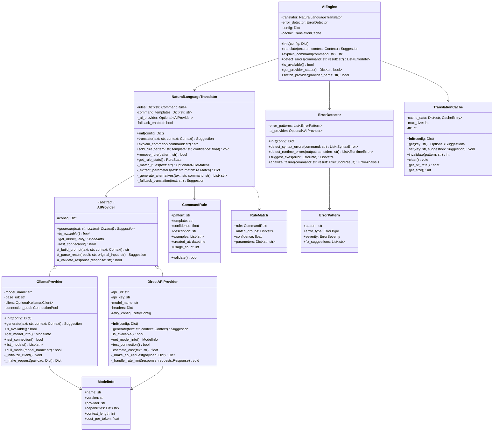
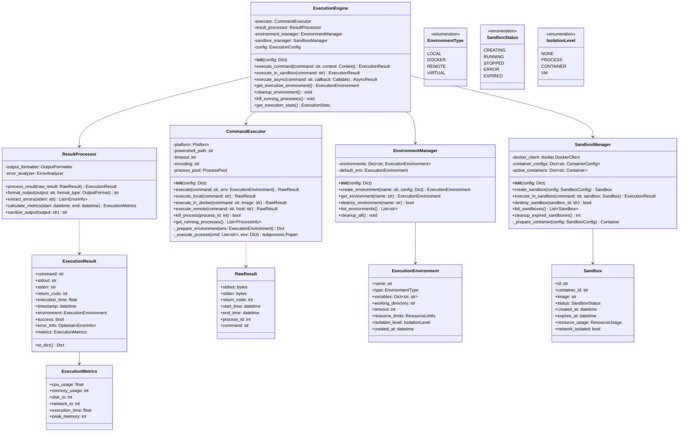
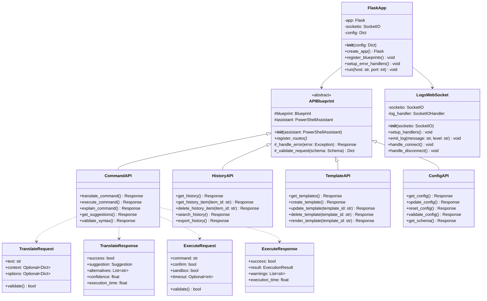

# AI PowerShell 智能助手 - 类图

## 整体类图概览

```mermaid
classDiagram
    %% 主控制器类
    class PowerShellAssistant {
        -ai_engine: AIEngine
        -security_engine: SecurityEngine
        -execution_engine: ExecutionEngine
        -config_manager: ConfigManager
        -log_engine: LogEngine
        -storage_engine: StorageEngine
        -context_manager: ContextManager
        -ui_system: UISystem
        +__init__(config_path: str)
        +process_request(text: str) ProcessResult
        +get_history() List~CommandHistory~
        +get_templates() List~Template~
        +update_config(config: Dict) bool
        +shutdown() void
    }
    
    %% 接口定义
    class Context {
        <<interface>>
        +session_id: str
        +user_id: str
        +timestamp: datetime
        +previous_commands: List~str~
        +environment_vars: Dict
        +working_directory: str
    }
    
    class Suggestion {
        <<dataclass>>
        +original_input: str
        +generated_command: str
        +confidence_score: float
        +explanation: str
        +alternatives: List~str~
        +risk_level: RiskLevel
        +execution_time: Optional~float~
    }
    
    class ProcessResult {
        <<dataclass>>
        +success: bool
        +suggestion: Suggestion
        +execution_result: Optional~ExecutionResult~
        +error_message: Optional~str~
        +timestamp: datetime
        +session_id: str
    }
    
    %% AI引擎相关类
    class AIEngine {
        -translator: NaturalLanguageTranslator
        -error_detector: ErrorDetector
        -config: Dict
        +__init__(config: Dict)
        +translate(text: str, context: Context) Suggestion
        +explain_command(command: str) str
        +detect_errors(command: str, result: str) List~ErrorInfo~
        +is_available() bool
    }
    
    class NaturalLanguageTranslator {
        -rules: Dict~str, Tuple~
        -command_templates: Dict~str, str~
        -_ai_provider: Optional~AIProvider~
        +__init__(config: Dict)
        +translate(text: str, context: Context) Suggestion
        +explain_command(command: str) str
        -_match_rules(text: str) Optional~Tuple~
        -_generate_alternatives(text: str, command: str) List~str~
        -_fallback_translation(text: str) Suggestion
    }
    
    class AIProvider {
        <<abstract>>
        +generate(text: str, context: Context) Suggestion*
        +is_available() bool*
        #_build_prompt(text: str, context: Context) str
        #_parse_result(result: str, original_input: str) Suggestion
    }
    
    class OllamaProvider {
        -config: Dict
        -model_name: str
        -base_url: str
        -client: Optional~ollama.Client~
        +__init__(config: Dict)
        +generate(text: str, context: Context) Suggestion
        +is_available() bool
        -_initialize_client() void
    }
    
    class DirectAPIProvider {
        -config: Dict
        -api_url: str
        -api_key: str
        -model_name: str
        -headers: Dict
        +__init__(config: Dict)
        +generate(text: str, context: Context) Suggestion
        +is_available() bool
    }
    
    class MockProvider {
        -config: Dict
        +__init__(config: Dict)
        +generate(text: str, context: Context) Suggestion
        +is_available() bool
    }
    
    %% 安全引擎相关类
    class SecurityEngine {
        -validator: CommandValidator
        -policy_engine: PolicyEngine
        -risk_assessor: RiskAssessor
        -config: Dict
        +__init__(config: Dict)
        +validate_command(command: str, context: Context) SecurityResult
        +assess_risk(command: str) RiskLevel
        +check_permissions(command: str) bool
        +update_policies(policies: Dict) void
    }
    
    class CommandValidator {
        -whitelist_patterns: List~str~
        -dangerous_patterns: List~str~
        -safe_prefixes: List~str~
        +__init__(config: Dict)
        +validate(command: str) ValidationResult
        +is_whitelisted(command: str) bool
        +is_dangerous(command: str) bool
        +check_syntax(command: str) bool
    }
    
    class PolicyEngine {
        -security_mode: SecurityMode
        -custom_rules: List~SecurityRule~
        +__init__(config: Dict)
        +apply_policies(command: str, validation: ValidationResult) SecurityDecision
        +add_rule(rule: SecurityRule) void
        +remove_rule(rule_id: str) bool
    }
    
    class RiskAssessor {
        +assess_command_risk(command: str) RiskLevel
        +calculate_risk_score(factors: List~RiskFactor~) float
        +get_risk_factors(command: str) List~RiskFactor~
    }
    
    %% 执行引擎相关类
    class ExecutionEngine {
        -executor: CommandExecutor
        -result_processor: ResultProcessor
        -config: Dict
        +__init__(config: Dict)
        +execute_command(command: str, context: Context) ExecutionResult
        +execute_in_sandbox(command: str) ExecutionResult
        +get_execution_environment() ExecutionEnvironment
        +cleanup_environment() void
    }
    
    class CommandExecutor {
        -platform: Platform
        -powershell_path: str
        -timeout: int
        +__init__(config: Dict)
        +execute(command: str, env: ExecutionEnvironment) RawResult
        +execute_local(command: str) RawResult
        +execute_in_docker(command: str) RawResult
        +kill_process(process_id: int) bool
    }
    
    class ResultProcessor {
        +process_result(raw_result: RawResult) ExecutionResult
        +format_output(output: str) str
        +extract_errors(stderr: str) List~ErrorInfo~
        +calculate_execution_time(start: datetime, end: datetime) float
    }
    
    %% 配置管理相关类
    class ConfigManager {
        -config_path: str
        -config_data: Dict
        -validators: Dict~str, Callable~
        +__init__(config_path: str)
        +load_config() Dict
        +save_config(config: Dict) bool
        +get_value(key: str, default: Any) Any
        +set_value(key: str, value: Any) void
        +validate_config(config: Dict) ValidationResult
        +reload_config() void
    }
    
    %% 存储引擎相关类
    class StorageEngine {
        -base_path: str
        -file_manager: FileManager
        -cache_manager: CacheManager
        +__init__(config: Dict)
        +save_history(history: CommandHistory) bool
        +load_history(limit: int) List~CommandHistory~
        +save_template(template: Template) bool
        +load_templates() List~Template~
        +clear_cache() void
    }
    
    class FileManager {
        -base_path: str
        +__init__(base_path: str)
        +read_file(path: str) str
        +write_file(path: str, content: str) bool
        +delete_file(path: str) bool
        +list_files(directory: str) List~str~
        +ensure_directory(path: str) bool
    }
    
    class CacheManager {
        -cache_size: int
        -cache_data: Dict
        +__init__(config: Dict)
        +get(key: str) Optional~Any~
        +set(key: str, value: Any, ttl: int) void
        +delete(key: str) bool
        +clear() void
        +get_stats() CacheStats
    }
    
    %% 数据模型类
    class CommandHistory {
        +id: str
        +timestamp: datetime
        +original_input: str
        +generated_command: str
        +execution_result: Optional~ExecutionResult~
        +success: bool
        +session_id: str
        +user_id: str
        +to_dict() Dict
        +from_dict(data: Dict) CommandHistory
    }
    
    class Template {
        +id: str
        +name: str
        +description: str
        +category: str
        +command_template: str
        +parameters: List~TemplateParameter~
        +created_at: datetime
        +updated_at: datetime
        +author: str
        +tags: List~str~
        +validate() bool
        +render(params: Dict) str
    }
    
    class ExecutionResult {
        +command: str
        +stdout: str
        +stderr: str
        +return_code: int
        +execution_time: float
        +timestamp: datetime
        +environment: ExecutionEnvironment
        +success: bool
        +error_info: Optional~ErrorInfo~
    }
    
    %% 枚举类
    class RiskLevel {
        <<enumeration>>
        LOW
        MEDIUM
        HIGH
        CRITICAL
    }
    
    class SecurityMode {
        <<enumeration>>
        STRICT
        MODERATE
        PERMISSIVE
    }
    
    class Platform {
        <<enumeration>>
        WINDOWS
        LINUX
        MACOS
    }
    
    %% 关系定义
    PowerShellAssistant --> AIEngine
    PowerShellAssistant --> SecurityEngine
    PowerShellAssistant --> ExecutionEngine
    PowerShellAssistant --> ConfigManager
    PowerShellAssistant --> StorageEngine
    
    AIEngine --> NaturalLanguageTranslator
    NaturalLanguageTranslator --> AIProvider
    AIProvider <|-- OllamaProvider
    AIProvider <|-- DirectAPIProvider
    AIProvider <|-- MockProvider
    
    SecurityEngine --> CommandValidator
    SecurityEngine --> PolicyEngine
    SecurityEngine --> RiskAssessor
    
    ExecutionEngine --> CommandExecutor
    ExecutionEngine --> ResultProcessor
    
    StorageEngine --> FileManager
    StorageEngine --> CacheManager
    
    PowerShellAssistant ..> Context
    PowerShellAssistant ..> Suggestion
    PowerShellAssistant ..> ProcessResult
    StorageEngine ..> CommandHistory
    StorageEngine ..> Template
    ExecutionEngine ..> ExecutionResult
    SecurityEngine ..> RiskLevel
    PolicyEngine ..> SecurityMode
    CommandExecutor ..> Platform
```

## AI引擎类图详解

## 安全引擎类图详解

```mermaid
classDiagram
    %% 安全引擎核心类
    class SecurityEngine {
        -validator: CommandValidator
        -policy_engine: PolicyEngine
        -risk_assessor: RiskAssessor
        -audit_logger: AuditLogger
        -config: SecurityConfig
        +__init__(config: Dict)
        +validate_command(command: str, context: Context) SecurityResult
        +assess_risk(command: str) RiskAssessment
        +check_permissions(command: str, user: User) PermissionResult
        +update_policies(policies: List~SecurityPolicy~) void
        +get_security_report() SecurityReport
        +enable_sandbox_mode() void
        +disable_sandbox_mode() void
    }
    
    class CommandValidator {
        -whitelist_patterns: List~WhitelistRule~
        -blacklist_patterns: List~BlacklistRule~
        -syntax_checker: SyntaxChecker
        +__init__(config: Dict)
        +validate(command: str) ValidationResult
        +is_whitelisted(command: str) bool
        +is_blacklisted(command: str) bool
        +check_syntax(command: str) SyntaxValidation
        +add_whitelist_rule(rule: WhitelistRule) void
        +add_blacklist_rule(rule: BlacklistRule) void
        +get_validation_stats() ValidationStats
    }
    
    class PolicyEngine {
        -security_mode: SecurityMode
        -policies: List~SecurityPolicy~
        -rule_engine: RuleEngine
        +__init__(config: Dict)
        +apply_policies(command: str, validation: ValidationResult) SecurityDecision
        +add_policy(policy: SecurityPolicy) void
        +remove_policy(policy_id: str) bool
        +evaluate_conditions(command: str, context: Context) bool
        +get_applicable_policies(command: str) List~SecurityPolicy~
    }
    
    class RiskAssessor {
        -risk_factors: List~RiskFactor~
        -scoring_model: RiskScoringModel
        +assess_command_risk(command: str) RiskAssessment
        +calculate_risk_score(factors: List~RiskFactor~) float
        +get_risk_factors(command: str) List~RiskFactor~
        +update_risk_model(model: RiskScoringModel) void
        +get_risk_history(command_pattern: str) List~RiskAssessment~
    }
    
    class AuditLogger {
        -log_file: str
        -log_level: LogLevel
        -formatter: AuditFormatter
        +__init__(config: Dict)
        +log_security_event(event: SecurityEvent) void
        +log_access_attempt(user: str, command: str, result: bool) void
        +log_policy_violation(violation: PolicyViolation) void
        +get_audit_trail(start_time: datetime, end_time: datetime) List~AuditEntry~
    }
    
    %% 数据模型类
    class SecurityResult {
        +is_allowed: bool
        +risk_level: RiskLevel
        +violations: List~PolicyViolation~
        +recommendations: List~str~
        +execution_mode: ExecutionMode
        +timestamp: datetime
    }
    
    class ValidationResult {
        +is_valid: bool
        +syntax_errors: List~SyntaxError~
        +whitelist_match: Optional~WhitelistRule~
        +blacklist_violations: List~BlacklistRule~
        +confidence_score: float
    }
    
    class SecurityPolicy {
        +id: str
        +name: str
        +description: str
        +conditions: List~PolicyCondition~
        +actions: List~PolicyAction~
        +priority: int
        +enabled: bool
        +created_at: datetime
        +evaluate(command: str, context: Context) bool
    }
    
    class RiskFactor {
        +name: str
        +weight: float
        +value: float
        +description: str
        +category: RiskCategory
    }
    
    class RiskAssessment {
        +command: str
        +risk_level: RiskLevel
        +risk_score: float
        +factors: List~RiskFactor~
        +mitigation_suggestions: List~str~
        +timestamp: datetime
    }
    
    %% 枚举类
    class ExecutionMode {
        <<enumeration>>
        DIRECT
        SANDBOX
        BLOCKED
        INTERACTIVE
    }
    
    class RiskCategory {
        <<enumeration>>
        SYSTEM_MODIFICATION
        DATA_ACCESS
        NETWORK_OPERATION
        PRIVILEGE_ESCALATION
        RESOURCE_CONSUMPTION
    }
    
    %% 关系
    SecurityEngine --> CommandValidator
    SecurityEngine --> PolicyEngine
    SecurityEngine --> RiskAssessor
    SecurityEngine --> AuditLogger
    CommandValidator ..> ValidationResult
    PolicyEngine ..> SecurityDecision
    PolicyEngine --> SecurityPolicy
    RiskAssessor ..> RiskAssessment
    RiskAssessor --> RiskFactor
    SecurityEngine ..> SecurityResult
```

## 执行引擎类图详解

## Web API类图

## 类图设计原则

### **SOLID原则应用**

1. **单一职责原则 (SRP)**
   - 每个类只负责一个功能领域
   - AI引擎只处理翻译，安全引擎只处理验证

2. **开闭原则 (OCP)**
   - 通过接口和抽象类支持扩展
   - 新的AI提供商可以通过实现AIProvider接口添加

3. **里氏替换原则 (LSP)**
   - 所有AIProvider的实现都可以互相替换
   - 不同的执行环境可以透明切换

4. **接口隔离原则 (ISP)**
   - 接口设计精简，只包含必要方法
   - 客户端不依赖不需要的接口

5. **依赖倒置原则 (DIP)**
   - 高层模块不依赖低层模块
   - 都依赖于抽象接口

### **设计模式应用**

- **策略模式**: AIProvider的不同实现
- **工厂模式**: 创建不同类型的执行环境
- **观察者模式**: 日志系统的事件通知
- **装饰器模式**: 安全验证的层层包装
- **单例模式**: 配置管理器的全局实例

这个类图完整展示了AI PowerShell系统的面向对象设计，体现了良好的软件工程实践和设计模式应用。