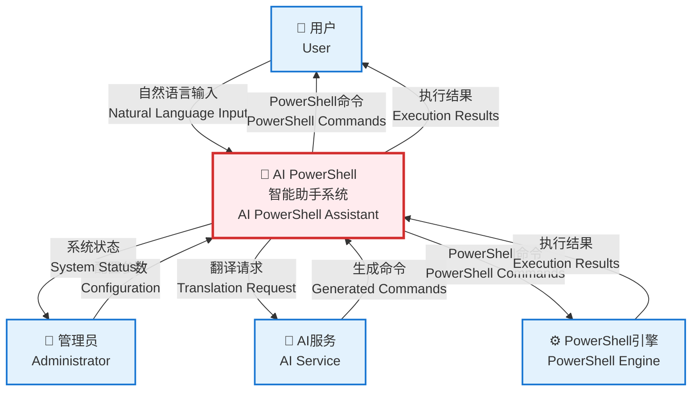
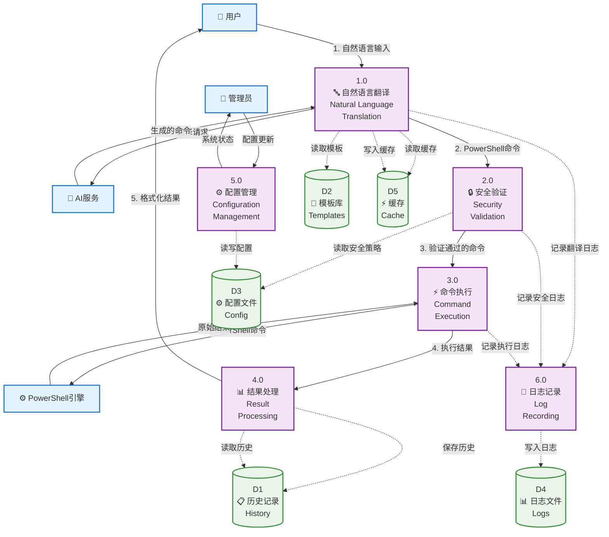
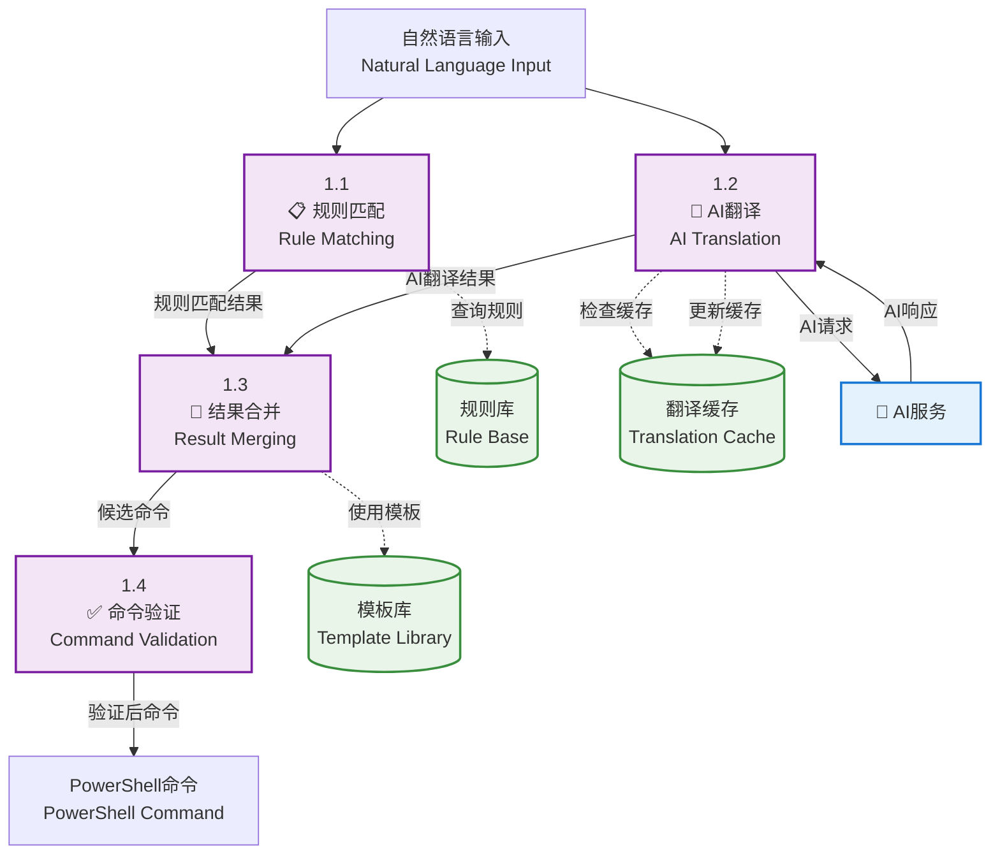
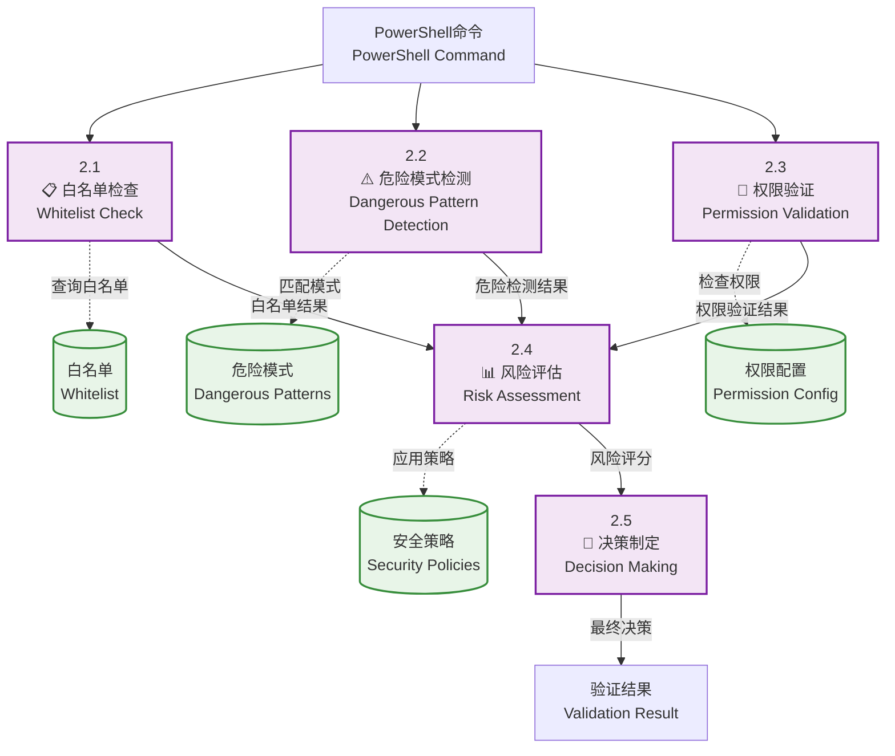
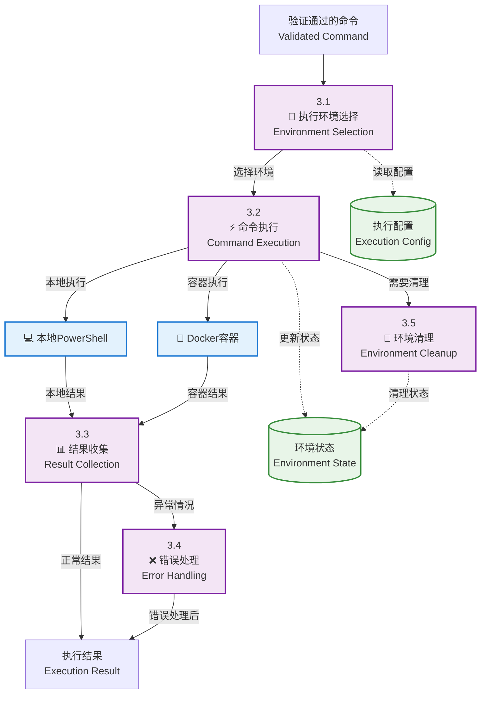
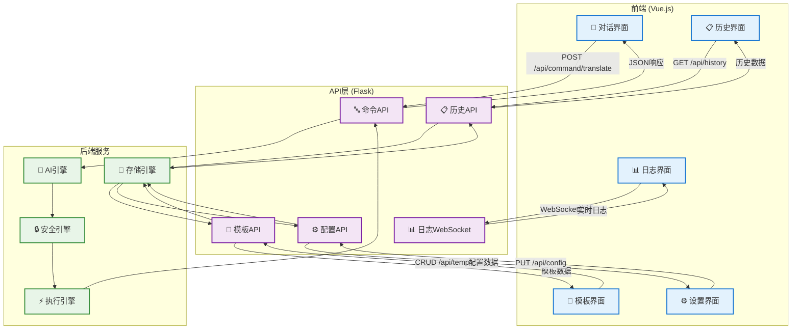
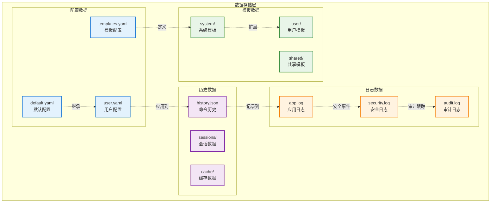
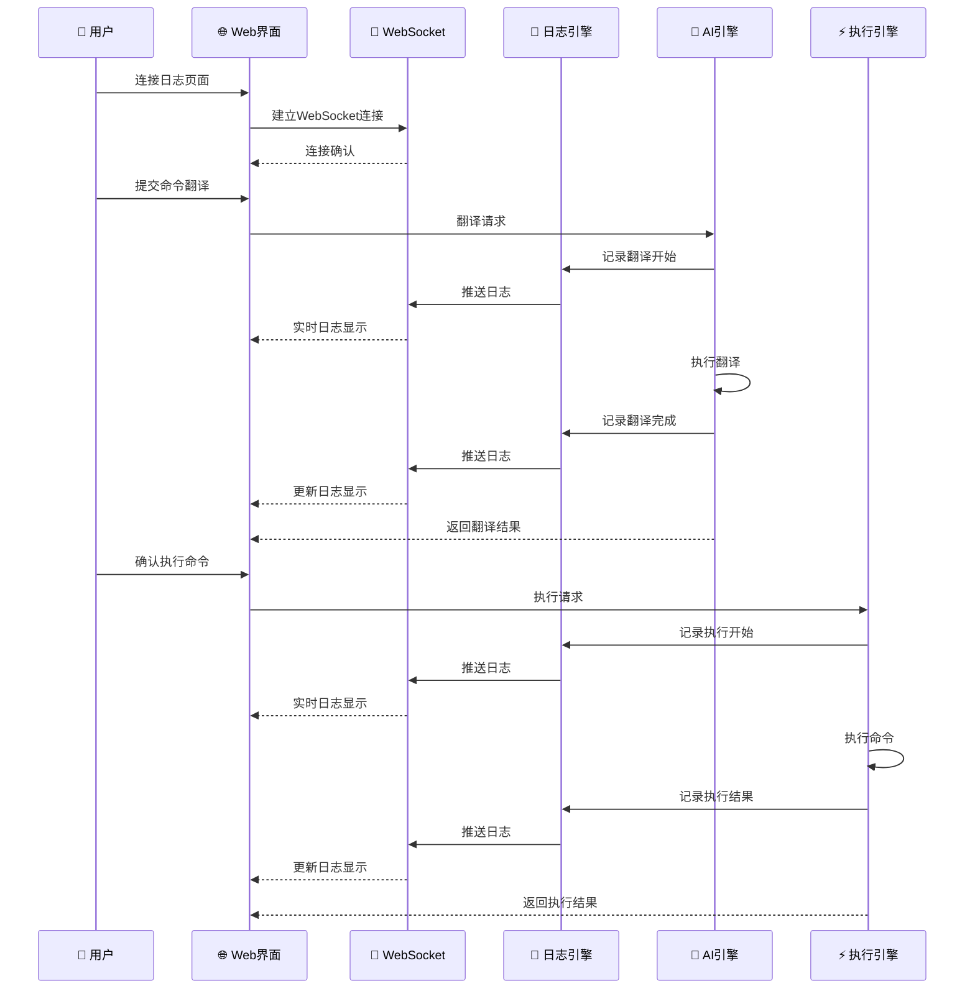

# AI PowerShell 智能助手 - 数据流图

## 0级数据流图 (Context Diagram)

## 1级数据流图 (Level 1 DFD)

## 2级数据流图 - 自然语言翻译过程

## 2级数据流图 - 安全验证过程

## 2级数据流图 - 命令执行过程

## Web界面数据流图

## 数据存储结构图

## 实时数据流 (WebSocket)

## 数据流图符号说明

### 基本符号
- **圆角矩形**: 外部实体 (External Entity)
- **圆形**: 处理过程 (Process)
- **开口矩形**: 数据存储 (Data Store)
- **箭头**: 数据流 (Data Flow)

### 编号规则
- **0级**: 系统整体视图
- **1级**: 主要功能分解
- **2级**: 详细过程分解
- **D1, D2...**: 数据存储编号
- **1.0, 2.0...**: 主过程编号
- **1.1, 1.2...**: 子过程编号

### 数据流命名
- 使用名词短语
- 描述数据内容而非操作
- 中英文对照标注
- 保持简洁明确

这个数据流图完整展示了AI PowerShell系统中数据的流动过程，从用户输入到最终结果输出的各个环节，有助于理解系统的工作机制和数据处理逻辑。