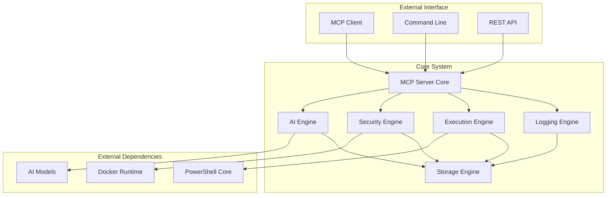

# Developer Guide

This guide covers extending, maintaining, and contributing to the AI PowerShell Assistant.

## Table of Contents

- [Architecture Overview](architecture.md)
- [Development Setup](development-setup.md)
- [Component Development](components.md)
- [Testing Guide](testing.md)
- [API Extensions](api-extensions.md)
- [Contributing Guidelines](contributing.md)

## Architecture Overview

The AI PowerShell Assistant follows a modular architecture with six main components:

### Core Components

1. **MCP Server Core** (`src/mcp_server/`)
   - FastMCP-based server implementation
   - Tool registration and discovery
   - Request/response handling

2. **AI Engine** (`src/ai_engine/`)
   - Local AI model integration
   - Natural language processing
   - Command generation and validation

3. **Security Engine** (`src/security/`)
   - Three-tier security validation
   - Command whitelisting
   - Sandbox execution management

4. **Execution Engine** (`src/execution/`)
   - Cross-platform PowerShell execution
   - Output formatting and standardization
   - Platform adaptation

5. **Logging Engine** (`src/log_engine/`)
   - Comprehensive audit trail
   - Performance monitoring
   - Correlation tracking

6. **Storage Engine** (`src/storage/`)
   - Configuration management
   - Data persistence
   - Backup and migration

### Component Interactions



## Development Principles

### Design Patterns

1. **Dependency Injection**: Components receive dependencies through constructors
2. **Interface Segregation**: Small, focused interfaces for each component
3. **Single Responsibility**: Each class has one clear purpose
4. **Open/Closed Principle**: Extensible without modifying existing code
5. **Factory Pattern**: Component creation through factory methods

### Code Organization

```
src/
├── interfaces/          # Base interfaces and contracts
├── mcp_server/         # MCP server implementation
├── ai_engine/          # AI processing components
├── security/           # Security validation components
├── execution/          # PowerShell execution components
├── log_engine/         # Logging and audit components
├── storage/            # Data persistence components
├── config/             # Configuration management
└── main.py            # Application entry point
```

### Key Interfaces

#### Base Interfaces (`src/interfaces/base.py`)

```python
class MCPServerInterface(ABC):
    """Interface for MCP server implementations"""
    
    @abstractmethod
    def register_tools(self) -> None:
        """Register MCP tools"""
        pass
    
    @abstractmethod
    async def start_server(self) -> None:
        """Start the MCP server"""
        pass
    
    @abstractmethod
    def shutdown(self) -> None:
        """Shutdown the server gracefully"""
        pass

class AIEngineInterface(ABC):
    """Interface for AI processing engines"""
    
    @abstractmethod
    def translate_natural_language(self, input_text: str, context: CommandContext) -> CommandSuggestion:
        """Convert natural language to PowerShell commands"""
        pass
    
    @abstractmethod
    def detect_command_errors(self, command: str) -> List[ErrorSuggestion]:
        """Detect errors in PowerShell commands"""
        pass

class SecurityEngineInterface(ABC):
    """Interface for security validation engines"""
    
    @abstractmethod
    def validate_command(self, command: str) -> ValidationResult:
        """Validate command against security policies"""
        pass
    
    @abstractmethod
    def execute_in_sandbox(self, command: str, timeout: int) -> SandboxResult:
        """Execute command in isolated sandbox"""
        pass
```

## Component Development

### Creating New Components

1. **Define Interface**: Create interface in `src/interfaces/`
2. **Implement Component**: Create implementation in appropriate directory
3. **Add Tests**: Create comprehensive test suite
4. **Update Configuration**: Add configuration options
5. **Document API**: Update API documentation

#### Example: Custom AI Provider

```python
# src/interfaces/ai_provider.py
class AIProviderInterface(ABC):
    """Interface for AI model providers"""
    
    @abstractmethod
    def initialize(self, config: Dict[str, Any]) -> bool:
        """Initialize the AI provider"""
        pass
    
    @abstractmethod
    def generate_command(self, prompt: str, context: Dict[str, Any]) -> str:
        """Generate PowerShell command from prompt"""
        pass

# src/ai_engine/providers/custom_provider.py
class CustomAIProvider(AIProviderInterface):
    """Custom AI provider implementation"""
    
    def __init__(self, config: CustomProviderConfig):
        self.config = config
        self.model = None
    
    def initialize(self, config: Dict[str, Any]) -> bool:
        """Initialize custom AI model"""
        try:
            self.model = CustomModel(config['model_path'])
            return True
        except Exception as e:
            logger.error(f"Failed to initialize custom provider: {e}")
            return False
    
    def generate_command(self, prompt: str, context: Dict[str, Any]) -> str:
        """Generate command using custom model"""
        # Implementation details
        pass
```

### Extending Existing Components

#### Adding New Security Rules

```python
# src/security/rules/custom_rules.py
class CustomSecurityRule(SecurityRuleInterface):
    """Custom security rule implementation"""
    
    def __init__(self, config: Dict[str, Any]):
        self.patterns = config.get('patterns', [])
        self.action = config.get('action', 'block')
    
    def evaluate(self, command: str, context: CommandContext) -> RuleResult:
        """Evaluate command against custom rule"""
        for pattern in self.patterns:
            if re.match(pattern, command):
                return RuleResult(
                    matched=True,
                    action=self.action,
                    reason=f"Matched pattern: {pattern}"
                )
        return RuleResult(matched=False)

# Register the rule
security_engine.register_rule('custom_rule', CustomSecurityRule)
```

#### Adding New Output Formatters

```python
# src/execution/formatters/custom_formatter.py
class CustomOutputFormatter(OutputFormatterInterface):
    """Custom output formatter"""
    
    def format(self, output: str, format_type: str) -> FormattedOutput:
        """Format output in custom format"""
        if format_type == 'custom':
            # Custom formatting logic
            formatted = self._apply_custom_format(output)
            return FormattedOutput(
                content=formatted,
                format_type='custom',
                metadata={'formatter': 'custom'}
            )
        return super().format(output, format_type)

# Register the formatter
execution_engine.register_formatter('custom', CustomOutputFormatter)
```

## Testing Strategy

### Test Structure

```
tests/
├── unit/               # Unit tests for individual components
├── integration/        # Integration tests for component interactions
├── end_to_end/        # End-to-end workflow tests
├── performance/       # Performance and load tests
├── security/          # Security and penetration tests
└── fixtures/          # Test data and fixtures
```

### Writing Tests

#### Unit Tests

```python
# tests/unit/test_ai_engine.py
import pytest
from unittest.mock import Mock, patch
from src.ai_engine.engine import AIEngine
from src.config.models import AIModelConfig

class TestAIEngine:
    
    @pytest.fixture
    def ai_config(self):
        return AIModelConfig(
            model_type='llama-cpp',
            model_path='/path/to/model.bin',
            temperature=0.7
        )
    
    @pytest.fixture
    def ai_engine(self, ai_config):
        return AIEngine(ai_config)
    
    def test_translate_natural_language_success(self, ai_engine):
        """Test successful natural language translation"""
        input_text = "list running processes"
        context = Mock()
        
        result = ai_engine.translate_natural_language(input_text, context)
        
        assert result.success
        assert result.generated_command
        assert result.confidence_score > 0
    
    def test_translate_natural_language_empty_input(self, ai_engine):
        """Test translation with empty input"""
        with pytest.raises(ValueError, match="Input text cannot be empty"):
            ai_engine.translate_natural_language("", Mock())
    
    @patch('src.ai_engine.providers.llama_cpp.LlamaCppProvider')
    def test_model_initialization_failure(self, mock_provider, ai_config):
        """Test handling of model initialization failure"""
        mock_provider.return_value.initialize.return_value = False
        
        ai_engine = AIEngine(ai_config)
        
        assert not ai_engine.is_initialized
```

#### Integration Tests

```python
# tests/integration/test_mcp_server_integration.py
import pytest
import asyncio
from src.mcp_server.server import PowerShellAssistantMCP
from src.config.models import ServerConfig

class TestMCPServerIntegration:
    
    @pytest.fixture
    async def mcp_server(self):
        config = ServerConfig.load_test_config()
        server = PowerShellAssistantMCP(config)
        
        # Set up test components
        server.set_components(
            ai_engine=Mock(),
            security_engine=Mock(),
            executor=Mock(),
            context_manager=Mock(),
            logging_engine=Mock()
        )
        
        yield server
        
        # Cleanup
        server.shutdown()
    
    async def test_natural_language_processing_flow(self, mcp_server):
        """Test complete natural language processing flow"""
        request_data = {
            'input_text': 'list running processes',
            'session_id': 'test_session'
        }
        
        result = await mcp_server._handle_natural_language_request(
            request_data['input_text'],
            request_data['session_id'],
            {}
        )
        
        assert result['success']
        assert 'generated_command' in result
        assert 'correlation_id' in result
```

### Test Configuration

```python
# tests/conftest.py
import pytest
import tempfile
import shutil
from pathlib import Path

@pytest.fixture(scope="session")
def test_config_dir():
    """Create temporary configuration directory for tests"""
    temp_dir = tempfile.mkdtemp()
    yield Path(temp_dir)
    shutil.rmtree(temp_dir)

@pytest.fixture
def mock_ai_model():
    """Mock AI model for testing"""
    with patch('src.ai_engine.providers.base.BaseAIProvider') as mock:
        mock.return_value.generate_command.return_value = "Get-Process"
        yield mock

@pytest.fixture
def test_security_rules():
    """Test security rules configuration"""
    return {
        'rules': [
            {
                'name': 'allow_get_commands',
                'pattern': '^Get-',
                'action': 'allow',
                'risk_level': 'low'
            }
        ]
    }
```

## API Extensions

### Adding New MCP Tools

1. **Define Tool Schema**

```python
# src/mcp_server/schemas.py
class CustomToolRequest(BaseModel):
    """Schema for custom tool requests"""
    parameter1: str = Field(..., description="Required parameter")
    parameter2: Optional[int] = Field(None, description="Optional parameter")

class CustomToolResponse(BaseModel):
    """Schema for custom tool responses"""
    success: bool = Field(..., description="Operation success")
    result: Optional[str] = Field(None, description="Tool result")
    error: Optional[ToolError] = Field(None, description="Error information")
```

2. **Implement Tool Logic**

```python
# src/mcp_server/tools/custom_tool.py
class CustomTool:
    """Custom MCP tool implementation"""
    
    def __init__(self, dependencies):
        self.dependencies = dependencies
    
    async def execute(self, request: CustomToolRequest) -> CustomToolResponse:
        """Execute custom tool logic"""
        try:
            # Tool implementation
            result = self._process_request(request)
            
            return CustomToolResponse(
                success=True,
                result=result
            )
        except Exception as e:
            return CustomToolResponse(
                success=False,
                error=ToolError(
                    error_code="CUSTOM_TOOL_ERROR",
                    error_message=str(e),
                    timestamp=datetime.now().isoformat()
                )
            )
```

3. **Register Tool with Server**

```python
# src/mcp_server/server.py
def register_tools(self):
    # ... existing tools ...
    
    @self.app.tool()
    async def custom_tool(request: CustomToolRequest) -> Dict[str, Any]:
        """Custom tool for specific functionality"""
        tool = CustomTool(self.dependencies)
        response = await tool.execute(request)
        return response.model_dump()
```

### Creating Middleware

```python
# src/mcp_server/middleware/custom_middleware.py
class CustomMiddleware:
    """Custom middleware for request processing"""
    
    def __init__(self, config: Dict[str, Any]):
        self.config = config
    
    async def process_request(self, request: Dict[str, Any]) -> Dict[str, Any]:
        """Process incoming request"""
        # Add custom headers, validation, etc.
        request['custom_header'] = 'custom_value'
        return request
    
    async def process_response(self, response: Dict[str, Any]) -> Dict[str, Any]:
        """Process outgoing response"""
        # Add custom response processing
        response['processed_by'] = 'custom_middleware'
        return response

# Register middleware
server.add_middleware(CustomMiddleware(config))
```

## Configuration Extensions

### Adding New Configuration Sections

```python
# src/config/models.py
@dataclass
class CustomConfig:
    """Custom configuration section"""
    enabled: bool = True
    parameter1: str = "default_value"
    parameter2: int = 100
    
    @classmethod
    def from_dict(cls, data: Dict[str, Any]) -> 'CustomConfig':
        """Create from dictionary"""
        return cls(**data)

# Add to main configuration
@dataclass
class ServerConfig:
    # ... existing fields ...
    custom: CustomConfig = field(default_factory=CustomConfig)
```

### Custom Configuration Validators

```python
# src/config/validators.py
class CustomConfigValidator:
    """Validator for custom configuration"""
    
    def validate(self, config: CustomConfig) -> List[str]:
        """Validate custom configuration"""
        errors = []
        
        if not config.parameter1:
            errors.append("parameter1 cannot be empty")
        
        if config.parameter2 < 0:
            errors.append("parameter2 must be positive")
        
        return errors

# Register validator
config_manager.register_validator('custom', CustomConfigValidator())
```

## Performance Optimization

### Profiling and Monitoring

```python
# src/monitoring/profiler.py
import cProfile
import pstats
from functools import wraps

def profile_function(func):
    """Decorator to profile function performance"""
    @wraps(func)
    def wrapper(*args, **kwargs):
        profiler = cProfile.Profile()
        profiler.enable()
        
        try:
            result = func(*args, **kwargs)
        finally:
            profiler.disable()
            
            # Save profile data
            stats = pstats.Stats(profiler)
            stats.dump_stats(f'profile_{func.__name__}.prof')
        
        return result
    return wrapper

# Usage
@profile_function
def expensive_operation():
    # Implementation
    pass
```

### Caching Strategies

```python
# src/caching/cache_manager.py
from functools import lru_cache
import redis

class CacheManager:
    """Centralized cache management"""
    
    def __init__(self, config: CacheConfig):
        self.config = config
        self.redis_client = redis.Redis(**config.redis_config) if config.use_redis else None
    
    def get(self, key: str) -> Optional[Any]:
        """Get value from cache"""
        if self.redis_client:
            return self.redis_client.get(key)
        return self._memory_cache.get(key)
    
    def set(self, key: str, value: Any, ttl: int = 3600) -> None:
        """Set value in cache"""
        if self.redis_client:
            self.redis_client.setex(key, ttl, value)
        else:
            self._memory_cache[key] = value

# Usage with decorator
def cached_result(ttl=3600):
    def decorator(func):
        @wraps(func)
        def wrapper(*args, **kwargs):
            cache_key = f"{func.__name__}:{hash(str(args) + str(kwargs))}"
            
            result = cache_manager.get(cache_key)
            if result is None:
                result = func(*args, **kwargs)
                cache_manager.set(cache_key, result, ttl)
            
            return result
        return wrapper
    return decorator
```

## Deployment and Packaging

### Docker Configuration

```dockerfile
# Dockerfile
FROM python:3.11-slim

# Install system dependencies
RUN apt-get update && apt-get install -y \
    curl \
    docker.io \
    && rm -rf /var/lib/apt/lists/*

# Install PowerShell
RUN curl -L https://github.com/PowerShell/PowerShell/releases/download/v7.3.0/powershell_7.3.0-1.deb_amd64.deb -o powershell.deb \
    && dpkg -i powershell.deb \
    && rm powershell.deb

# Set working directory
WORKDIR /app

# Copy requirements and install Python dependencies
COPY requirements.txt .
RUN pip install --no-cache-dir -r requirements.txt

# Copy application code
COPY src/ ./src/
COPY config/ ./config/

# Create non-root user
RUN useradd -m -u 1000 appuser && chown -R appuser:appuser /app
USER appuser

# Expose port
EXPOSE 8000

# Health check
HEALTHCHECK --interval=30s --timeout=10s --start-period=5s --retries=3 \
    CMD curl -f http://localhost:8000/health || exit 1

# Start application
CMD ["python", "-m", "src.main"]
```

### Kubernetes Deployment

```yaml
# k8s/deployment.yaml
apiVersion: apps/v1
kind: Deployment
metadata:
  name: ai-powershell-assistant
spec:
  replicas: 3
  selector:
    matchLabels:
      app: ai-powershell-assistant
  template:
    metadata:
      labels:
        app: ai-powershell-assistant
    spec:
      containers:
      - name: ai-powershell-assistant
        image: ai-powershell-assistant:latest
        ports:
        - containerPort: 8000
        env:
        - name: POWERSHELL_ASSISTANT_LOG_LEVEL
          value: "INFO"
        resources:
          requests:
            memory: "512Mi"
            cpu: "250m"
          limits:
            memory: "2Gi"
            cpu: "1000m"
        volumeMounts:
        - name: config
          mountPath: /app/config
        - name: data
          mountPath: /app/data
      volumes:
      - name: config
        configMap:
          name: ai-powershell-assistant-config
      - name: data
        persistentVolumeClaim:
          claimName: ai-powershell-assistant-data
```

## Contributing Guidelines

### Code Style

1. **Follow PEP 8** for Python code style
2. **Use type hints** for all function parameters and return values
3. **Write docstrings** for all classes and functions
4. **Use meaningful variable names**
5. **Keep functions small and focused**

### Commit Guidelines

```bash
# Commit message format
<type>(<scope>): <description>

# Types: feat, fix, docs, style, refactor, test, chore
# Examples:
feat(ai-engine): add support for custom AI models
fix(security): resolve sandbox escape vulnerability
docs(api): update MCP tool documentation
test(integration): add end-to-end workflow tests
```

### Pull Request Process

1. **Fork the repository**
2. **Create feature branch**: `git checkout -b feature/new-feature`
3. **Write tests** for new functionality
4. **Update documentation**
5. **Run test suite**: `pytest tests/`
6. **Submit pull request** with detailed description

### Code Review Checklist

- [ ] Code follows style guidelines
- [ ] All tests pass
- [ ] Documentation is updated
- [ ] Security implications considered
- [ ] Performance impact assessed
- [ ] Backward compatibility maintained

## Next Steps

- Set up [Development Environment](development-setup.md)
- Learn about [Component Architecture](components.md)
- Write comprehensive [Tests](testing.md)
- Explore [API Extensions](api-extensions.md)
- Follow [Contributing Guidelines](contributing.md)