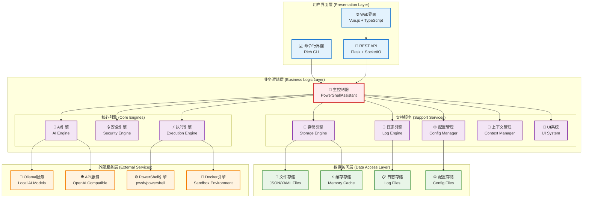
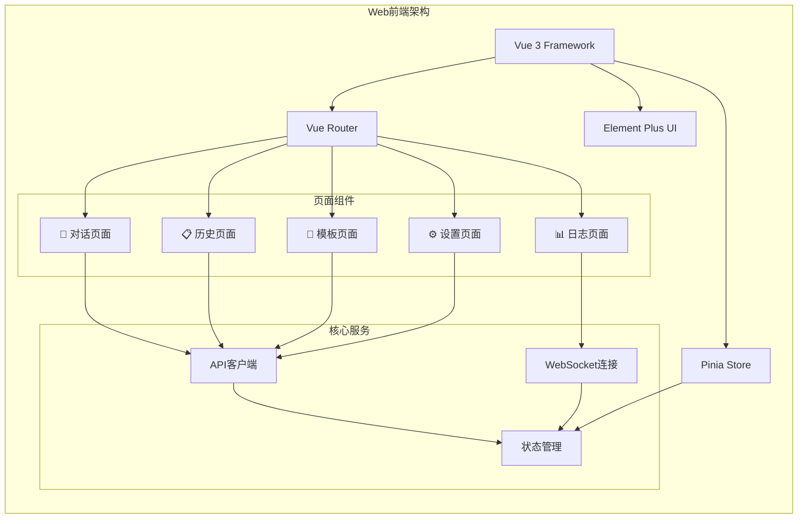
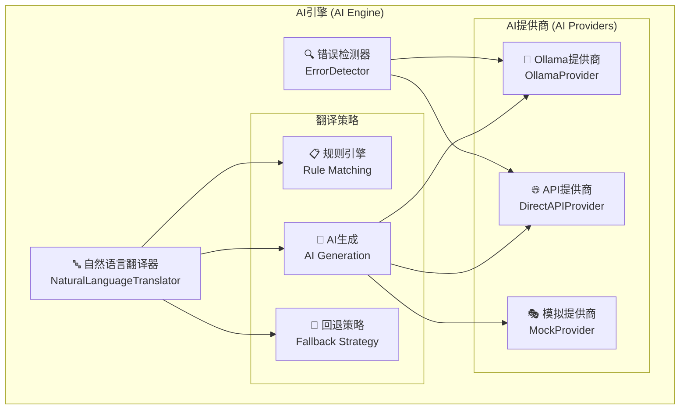
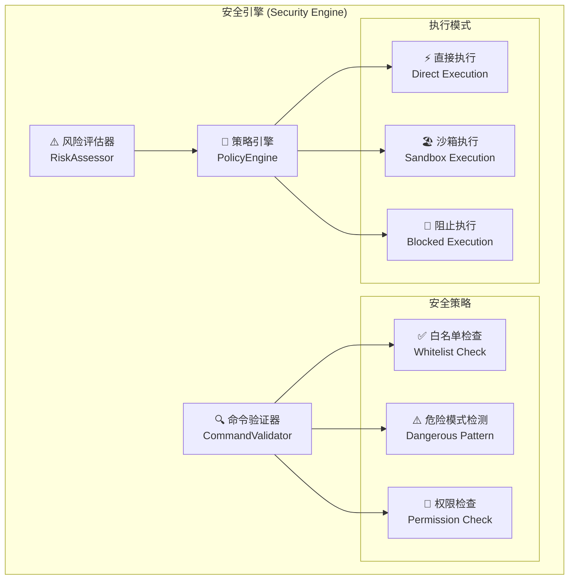
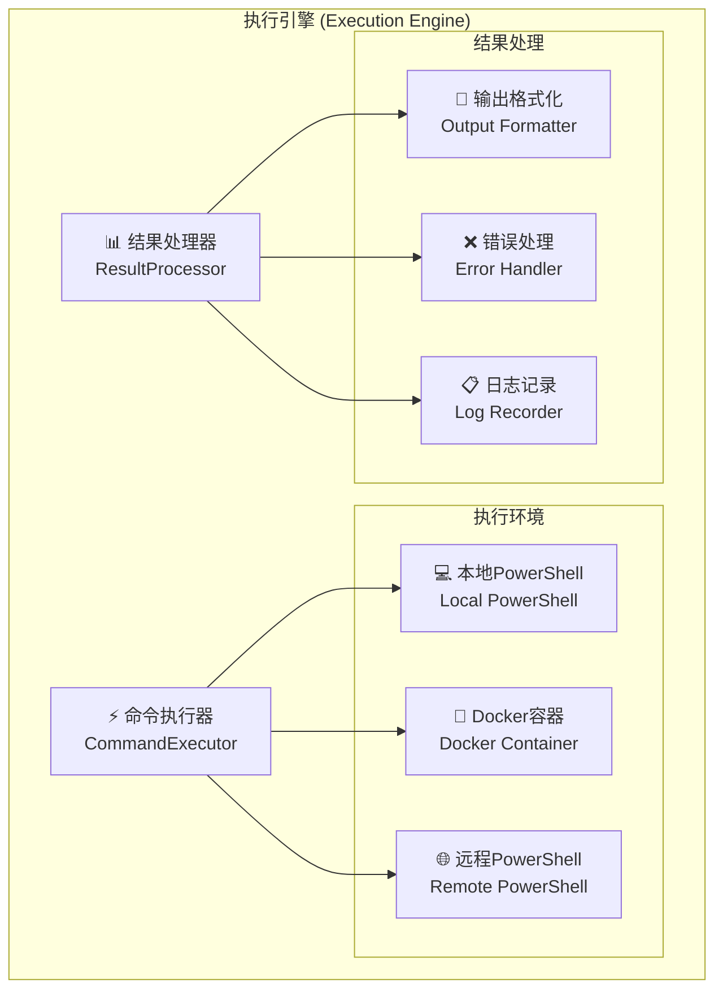
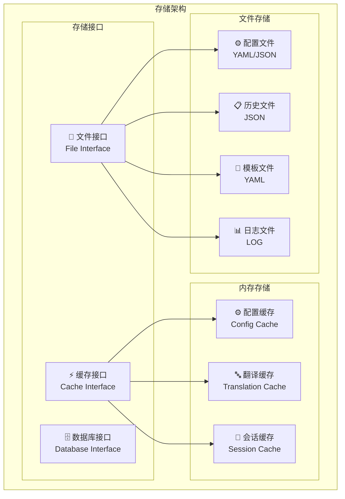
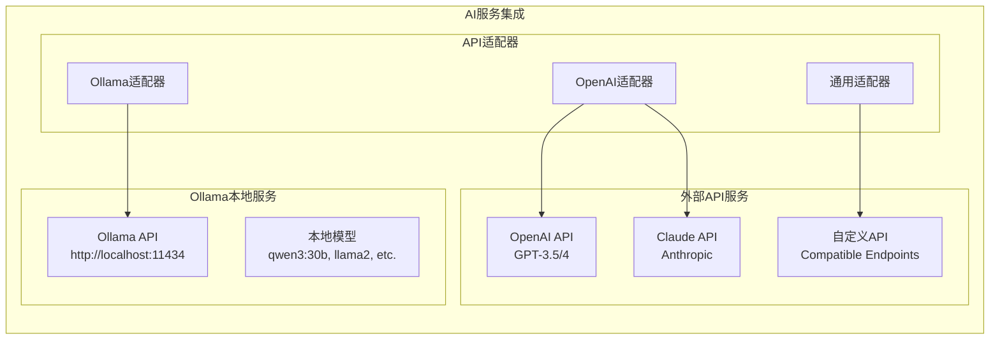
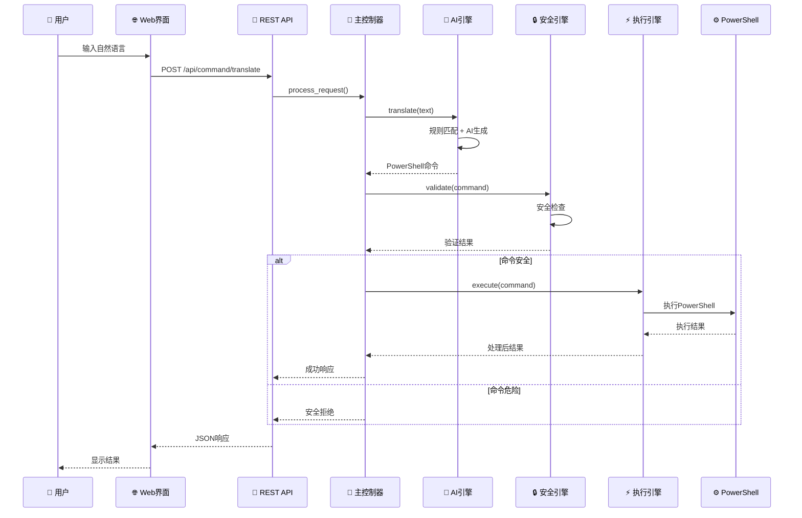
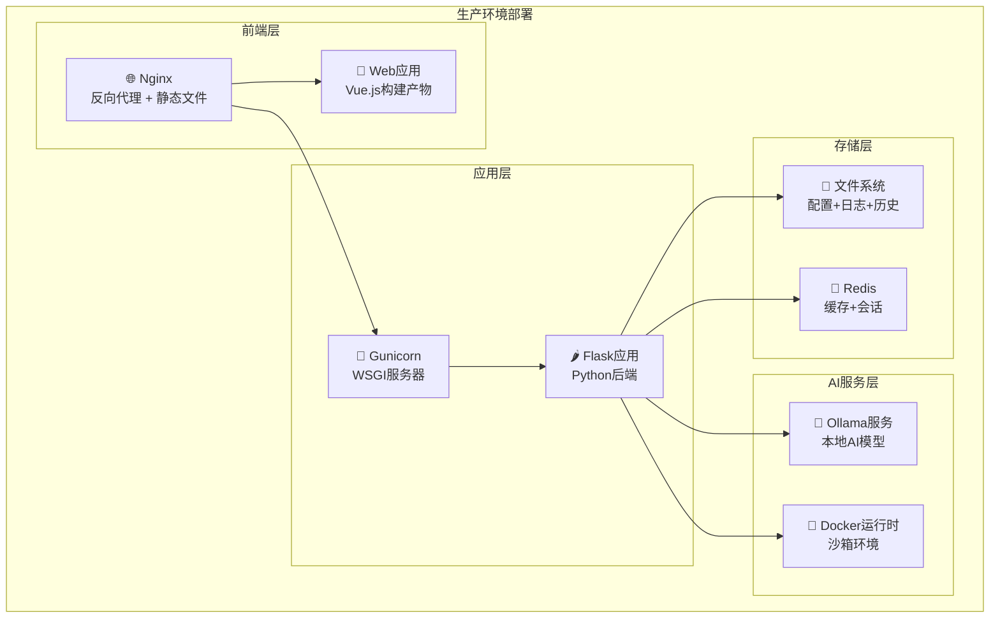

# AI PowerShell 智能助手 - 系统架构图

## 整体系统架构



## 分层架构详解

### 🌐 用户界面层 (Presentation Layer)

#### Web界面 (Vue.js + TypeScript)


#### 命令行界面 (Rich CLI)
- **Rich库**: 提供彩色输出和进度条
- **交互式输入**: 支持命令补全和历史
- **实时反馈**: 显示执行进度和结果

#### REST API (Flask + SocketIO)
- **RESTful接口**: 标准HTTP API
- **WebSocket**: 实时日志推送
- **认证授权**: JWT令牌验证
- **CORS支持**: 跨域资源共享

### 🎯 业务逻辑层 (Business Logic Layer)

#### 主控制器 (PowerShellAssistant)
```python
class PowerShellAssistant:
    """主控制器 - 协调各个引擎的工作"""
    
    def __init__(self):
        self.ai_engine = AIEngine()
        self.security_engine = SecurityEngine()
        self.execution_engine = ExecutionEngine()
        self.config_manager = ConfigManager()
        self.log_engine = LogEngine()
        self.storage_engine = StorageEngine()
        self.context_manager = ContextManager()
        self.ui_system = UISystem()
    
    def process_request(self, text: str) -> ProcessResult:
        """处理用户请求的主要流程"""
        # 1. 翻译自然语言
        # 2. 安全验证
        # 3. 执行命令
        # 4. 记录历史
        # 5. 返回结果
```

#### AI引擎架构


#### 安全引擎架构


#### 执行引擎架构


### 💾 数据访问层 (Data Access Layer)

#### 存储架构


### 🌐 外部服务层 (External Services)

#### AI服务集成


## 数据流架构



## 部署架构



## 技术栈总览

### 后端技术栈
- **Python 3.8+**: 主要编程语言
- **Flask**: Web框架
- **Flask-SocketIO**: WebSocket支持
- **Pydantic**: 数据验证
- **PyYAML**: 配置文件处理
- **Rich**: CLI美化
- **Ollama**: 本地AI模型
- **Docker**: 容器化和沙箱

### 前端技术栈
- **Vue 3**: 前端框架
- **TypeScript**: 类型安全
- **Vite**: 构建工具
- **Element Plus**: UI组件库
- **Pinia**: 状态管理
- **Axios**: HTTP客户端

### 基础设施
- **Nginx**: 反向代理
- **Gunicorn**: WSGI服务器
- **Redis**: 缓存存储
- **Docker**: 容器化部署
- **PowerShell Core**: 命令执行

## 设计原则

### 1. **模块化设计**
- 高内聚、低耦合
- 清晰的接口定义
- 可插拔的组件架构

### 2. **分层架构**
- 表现层、业务层、数据层分离
- 依赖倒置原则
- 单一职责原则

### 3. **安全优先**
- 多层安全验证
- 沙箱执行环境
- 最小权限原则

### 4. **可扩展性**
- 支持多种AI提供商
- 插件化架构
- 水平扩展能力

### 5. **用户体验**
- 响应式设计
- 实时反馈
- 错误友好提示

这个系统架构图展示了AI PowerShell智能助手的完整技术架构，从用户界面到底层服务的各个层次和组件关系。