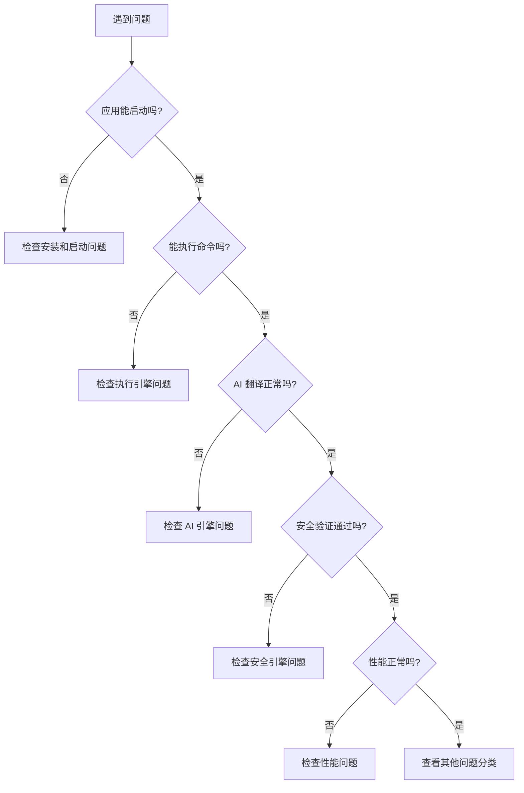

<!-- 文档类型: 参考文档 | 最后更新: 2025-01-17 | 维护者: 项目团队 -->

# 故障排除指南

> **文档类型**: 参考文档 | **最后更新**: 2025-01-17 | **维护者**: 项目团队

📍 [首页](../README.md) > [文档中心](README.md) > 故障排除指南

## 📋 目录

- [简介](#简介)
- [问题诊断流程](#问题诊断流程)
- [安装和启动问题](#安装和启动问题)
- [AI 引擎问题](#ai-引擎问题)
- [安全引擎问题](#安全引擎问题)
- [执行引擎问题](#执行引擎问题)
- [配置问题](#配置问题)
- [模板系统问题](#模板系统问题)
- [UI 系统问题](#ui-系统问题)
- [进度管理问题](#进度管理问题)
- [性能问题](#性能问题)
- [网络和连接问题](#网络和连接问题)
- [日志和调试](#日志和调试)
- [常见错误代码](#常见错误代码)
- [获取帮助](#获取帮助)

---

## 简介

本指南提供 AI PowerShell 智能助手常见问题的诊断和解决方案。每个问题包含：

- **症状**: 问题的表现形式
- **原因**: 问题产生的根本原因
- **解决步骤**: 详细的解决方法
- **预防措施**: 避免问题再次发生的建议

### 快速诊断

遇到问题时，首先尝试以下步骤：

1. **查看日志文件**: `logs/assistant.log`
2. **检查配置文件**: `config/default.yaml`
3. **验证环境**: Python 版本、PowerShell 版本
4. **重启应用**: 简单重启可以解决很多问题
5. **查看本指南**: 搜索相关问题和解决方案

---

## 问题诊断流程


### 诊断流程图



### 基本诊断命令

```bash
# 1. 检查 Python 版本
python --version

# 2. 检查 PowerShell 版本
pwsh --version  # PowerShell Core
powershell -Command '$PSVersionTable'  # Windows PowerShell

# 3. 验证安装
python scripts/verify_installation.py

# 4. 测试基本功能
python src/main.py --command "显示当前时间"

# 5. 查看日志
cat logs/assistant.log  # Linux/macOS
type logs\assistant.log  # Windows
```

---

## 安装和启动问题

### 问题 1: Python 版本不兼容

**症状**:
```
Error: Python 3.8 or higher is required
```

**原因**: 系统 Python 版本低于 3.8

**解决步骤**:

1. 检查当前 Python 版本：
   ```bash
   python --version
   ```

2. 升级 Python：
   - **Windows**: 从 [python.org](https://www.python.org/downloads/) 下载安装
   - **Linux**: 
     ```bash
     sudo apt update
     sudo apt install python3.10
     ```
   - **macOS**: 
     ```bash
     brew install python@3.10
     ```

3. 验证安装：
   ```bash
   python3.10 --version
   ```

**预防措施**:
- 使用虚拟环境隔离 Python 版本
- 定期更新 Python 到最新稳定版本


### 问题 2: 依赖包安装失败

**症状**:
```
ERROR: Could not find a version that satisfies the requirement pydantic>=2.0.0
```

**原因**: 
- 网络连接问题
- pip 版本过旧
- Python 版本不兼容

**解决步骤**:

1. 升级 pip：
   ```bash
   python -m pip install --upgrade pip
   ```

2. 使用国内镜像源（中国用户）：
   ```bash
   pip install -r requirements.txt -i https://pypi.tuna.tsinghua.edu.cn/simple
   ```

3. 逐个安装依赖：
   ```bash
   pip install pyyaml>=6.0.1
   pip install pydantic>=2.0.0
   pip install structlog>=23.1.0
   ```

4. 检查 Python 版本兼容性：
   ```bash
   python --version  # 确保 >= 3.8
   ```

**预防措施**:
- 使用虚拟环境
- 定期更新 pip
- 保存依赖版本锁定文件

### 问题 3: PowerShell 未找到

**症状**:
```
Error: PowerShell not found on this system
```

**原因**: 系统未安装 PowerShell 或未添加到 PATH

**解决步骤**:

1. **Windows 用户**:
   - Windows 10/11 自带 PowerShell 5.1
   - 安装 PowerShell Core 7+:
     ```powershell
     winget install Microsoft.PowerShell
     ```

2. **Linux 用户**:
   ```bash
   # Ubuntu/Debian
   sudo apt-get install -y powershell
   
   # CentOS/RHEL
   sudo yum install -y powershell
   ```

3. **macOS 用户**:
   ```bash
   brew install powershell/tap/powershell
   ```

4. 验证安装：
   ```bash
   pwsh --version
   ```

5. 手动指定 PowerShell 路径（如果自动检测失败）：
   ```yaml
   # config/default.yaml
   execution:
     powershell_path: "C:\\Program Files\\PowerShell\\7\\pwsh.exe"
     auto_detect_powershell: false
   ```

**预防措施**:
- 安装 PowerShell Core 7+ 以获得最佳兼容性
- 确保 PowerShell 在系统 PATH 中


### 问题 4: 首次运行向导重复出现

**症状**: 每次启动都运行首次运行向导

**原因**: 初始化标记文件被删除或未正确创建

**解决步骤**:

1. 检查标记文件是否存在：
   ```bash
   # Linux/macOS
   ls -la ~/.ai_powershell_initialized
   
   # Windows
   dir %USERPROFILE%\.ai_powershell_initialized
   ```

2. 手动创建标记文件：
   ```bash
   # Linux/macOS
   touch ~/.ai_powershell_initialized
   
   # Windows
   echo. > %USERPROFILE%\.ai_powershell_initialized
   ```

3. 检查文件权限：
   ```bash
   # Linux/macOS
   chmod 644 ~/.ai_powershell_initialized
   ```

**预防措施**:
- 不要删除 `.ai_powershell_initialized` 文件
- 确保用户主目录有写入权限

### 问题 5: 配置文件加载失败

**症状**:
```
Error: Failed to load configuration file
ValidationError: Invalid configuration
```

**原因**: 
- 配置文件格式错误
- 配置值超出范围
- 必需字段缺失

**解决步骤**:

1. 验证 YAML 语法：
   ```bash
   python -c "import yaml; yaml.safe_load(open('config/default.yaml'))"
   ```

2. 检查常见 YAML 错误：
   - 缩进使用空格（不是 Tab）
   - 冒号后有空格
   - 字符串正确引用

3. 重置为默认配置：
   ```bash
   cp config/default.yaml.backup config/default.yaml
   ```

4. 使用配置验证工具：
   ```python
   from src.config import ConfigManager
   manager = ConfigManager()
   is_valid, error = manager.validate_config_file("config/default.yaml")
   print(f"Valid: {is_valid}, Error: {error}")
   ```

**预防措施**:
- 修改配置前备份
- 使用 YAML 编辑器或验证器
- 参考 [配置参考文档](config-reference.md)

---

## AI 引擎问题

### 问题 6: AI 模型加载失败

**症状**:
```
Error: Failed to load AI model
RuntimeError: AI engine not available
```

**原因**:
- Ollama 服务未运行
- 模型未下载
- 网络连接问题
- 模型路径错误

**解决步骤**:

1. **检查 Ollama 服务状态**:
   ```bash
   # 检查服务是否运行
   curl http://localhost:11434/api/tags
   ```

2. **启动 Ollama 服务**:
   ```bash
   # Linux/macOS
   ollama serve
   
   # Windows
   ollama serve
   ```

3. **下载所需模型**:
   ```bash
   ollama pull llama2
   ollama pull qwen3:30b
   ```

4. **验证模型可用**:
   ```bash
   ollama list
   ```

5. **检查配置**:
   ```yaml
   # config/default.yaml
   ai:
     provider: ollama
     model_name: llama2  # 确保模型名称正确
     ollama_url: http://localhost:11434
   ```

6. **使用本地模式（临时方案）**:
   ```yaml
   ai:
     use_ai_provider: false  # 只使用规则匹配
   ```

**预防措施**:
- 确保 Ollama 服务自动启动
- 预先下载常用模型
- 配置健康检查


### 问题 7: AI 翻译结果不准确

**症状**: 生成的命令与预期不符或完全错误

**原因**:
- 输入描述不够清晰
- 缺少上下文信息
- AI 模型不适合
- 温度参数设置不当

**解决步骤**:

1. **改进输入描述**:
   ```
   ❌ 不好: "显示文件"
   ✅ 好: "显示当前目录下所有 .txt 文件，包括文件大小和修改时间"
   ```

2. **提供更多上下文**:
   - 在交互模式中，系统会自动使用历史命令作为上下文
   - 明确指定路径、文件类型等细节

3. **调整 AI 参数**:
   ```yaml
   ai:
     temperature: 0.5  # 降低温度使输出更确定
     max_tokens: 512   # 增加 token 数以获得更完整的响应
   ```

4. **尝试不同的模型**:
   ```yaml
   ai:
     model_name: qwen3:30b  # 尝试更大的模型
   ```

5. **清空缓存**:
   ```python
   from src.ai_engine import AIEngine
   engine = AIEngine()
   engine.clear_cache()
   ```

**预防措施**:
- 使用清晰、具体的描述
- 提供必要的上下文信息
- 选择适合任务的模型

### 问题 8: AI 响应速度慢

**症状**: AI 翻译需要很长时间（>10秒）

**原因**:
- 模型太大
- 硬件资源不足
- 缓存未启用
- 网络延迟（云端 AI）

**解决步骤**:

1. **启用缓存**:
   ```yaml
   ai:
     cache_enabled: true
     cache_size: 500  # 增大缓存
   ```

2. **使用更小的模型**:
   ```yaml
   ai:
     model_name: llama2  # 而不是 llama2:70b
   ```

3. **减少生成长度**:
   ```yaml
   ai:
     max_tokens: 128  # 减少 token 数
   ```

4. **优先使用规则匹配**:
   - 系统会先尝试规则匹配，只在失败时才使用 AI
   - 添加更多规则可以提高速度

5. **升级硬件**:
   - 增加 RAM（推荐 8GB+）
   - 使用 GPU 加速（如果支持）

**预防措施**:
- 根据硬件选择合适的模型
- 启用缓存
- 定期清理缓存

### 问题 9: 缓存命中率低

**症状**: 相同的查询每次都需要重新生成

**原因**:
- 缓存未启用
- 缓存大小太小
- 输入文本有细微差异

**解决步骤**:

1. **启用并配置缓存**:
   ```yaml
   ai:
     cache_enabled: true
     cache_size: 1000  # 增大缓存
   ```

2. **查看缓存统计**:
   ```python
   from src.ai_engine import AIEngine
   engine = AIEngine()
   stats = engine.get_cache_stats()
   print(f"缓存使用: {stats['size']}/{stats['max_size']}")
   ```

3. **标准化输入**:
   - 使用一致的表达方式
   - 避免不必要的空格和标点

**预防措施**:
- 配置足够大的缓存
- 使用标准化的命令描述

---

## 安全引擎问题

### 问题 10: 安全命令被误判为危险

**症状**: 安全的命令被阻止执行

**原因**:
- 白名单模式过于严格
- 命令模式匹配过于宽泛
- 自定义规则配置错误

**解决步骤**:

1. **调整白名单模式**:
   ```yaml
   security:
     whitelist_mode: moderate  # 从 strict 改为 moderate
   ```

2. **添加安全命令前缀**:
   ```yaml
   security:
     safe_prefixes:
       - Get-
       - Show-
       - Test-
       - Find-
       - Your-SafeCommand-  # 添加自定义前缀
   ```

3. **添加自定义安全规则**:
   ```yaml
   security:
     custom_rules:
       - pattern: "Your-Command"
         action: "allow"
         risk_level: "low"
         description: "自定义安全命令"
   ```

4. **临时跳过确认**（仅用于测试）:
   ```yaml
   security:
     require_confirmation: false
   ```

**预防措施**:
- 使用 `moderate` 模式而不是 `strict`
- 为常用安全命令添加白名单
- 定期审查安全规则


### 问题 11: 危险命令未被检测

**症状**: 明显危险的命令通过了安全检查

**原因**:
- 白名单模式过于宽松
- 危险模式列表不完整
- 命令使用了变体或混淆

**解决步骤**:

1. **使用严格模式**:
   ```yaml
   security:
     whitelist_mode: strict
   ```

2. **添加危险模式**:
   ```yaml
   security:
     dangerous_patterns:
       - "Your-Dangerous-Pattern"
       - "Remove-Item.*-Recurse.*-Force"
   ```

3. **启用沙箱执行**:
   ```yaml
   security:
     sandbox_enabled: true
   ```

4. **要求用户确认**:
   ```yaml
   security:
     require_confirmation: true
   ```

**预防措施**:
- 生产环境使用 `strict` 模式
- 定期更新危险模式列表
- 启用沙箱执行

### 问题 12: 沙箱执行失败

**症状**:
```
Error: Docker not available
Error: Sandbox execution failed
```

**原因**:
- Docker 未安装或未运行
- Docker 权限不足
- 网络配置问题

**解决步骤**:

1. **检查 Docker 状态**:
   ```bash
   docker --version
   docker ps
   ```

2. **启动 Docker 服务**:
   ```bash
   # Linux
   sudo systemctl start docker
   
   # macOS/Windows
   # 启动 Docker Desktop
   ```

3. **检查 Docker 权限**:
   ```bash
   # Linux: 将用户添加到 docker 组
   sudo usermod -aG docker $USER
   newgrp docker
   ```

4. **测试 Docker**:
   ```bash
   docker run hello-world
   ```

5. **禁用沙箱（临时方案）**:
   ```yaml
   security:
     sandbox_enabled: false
   ```

**预防措施**:
- 确保 Docker 服务自动启动
- 配置正确的用户权限
- 定期更新 Docker

---

## 执行引擎问题

### 问题 13: 命令执行超时

**症状**:
```
Error: Command execution timeout after 30 seconds
```

**原因**:
- 命令执行时间过长
- 超时设置过短
- 系统资源不足

**解决步骤**:

1. **增加超时时间**:
   ```yaml
   execution:
     timeout: 120  # 增加到 2 分钟
   ```

2. **检查命令是否卡住**:
   - 某些命令可能需要用户输入
   - 使用 `-NoProfile` 参数加快启动

3. **优化命令**:
   ```powershell
   # 慢
   Get-ChildItem -Recurse C:\
   
   # 快
   Get-ChildItem -Recurse C:\Users\Documents
   ```

4. **检查系统资源**:
   ```bash
   # 查看 CPU 和内存使用
   top  # Linux/macOS
   taskmgr  # Windows
   ```

**预防措施**:
- 为长时间运行的命令设置更长的超时
- 避免递归扫描大目录
- 优化命令性能

### 问题 14: 中文输出乱码

**症状**: PowerShell 输出的中文显示为乱码

**原因**:
- 编码设置不正确
- PowerShell 编码与系统不匹配

**解决步骤**:

1. **Windows 用户（使用 GBK）**:
   ```yaml
   execution:
     encoding: gbk
   ```

2. **Linux/macOS 用户（使用 UTF-8）**:
   ```yaml
   execution:
     encoding: utf-8
   ```

3. **在 PowerShell 中设置编码**:
   ```powershell
   [Console]::OutputEncoding = [System.Text.Encoding]::UTF8
   ```

4. **测试编码**:
   ```bash
   python src/main.py --command "显示当前时间"
   ```

**预防措施**:
- 根据操作系统选择正确的编码
- 使用 PowerShell Core 7+ 以获得更好的 UTF-8 支持


### 问题 15: 命令执行权限不足

**症状**:
```
Error: Access denied
Error: Administrator privileges required
```

**原因**:
- 命令需要管理员权限
- 文件或目录权限不足

**解决步骤**:

1. **以管理员身份运行**:
   ```bash
   # Windows
   # 右键点击 PowerShell，选择"以管理员身份运行"
   
   # Linux/macOS
   sudo python src/main.py --interactive
   ```

2. **检查文件权限**:
   ```bash
   # Linux/macOS
   ls -l /path/to/file
   chmod 755 /path/to/file
   ```

3. **使用非特权命令**:
   - 避免需要管理员权限的操作
   - 使用用户级别的替代命令

**预防措施**:
- 尽量使用非特权命令
- 明确标识需要管理员权限的操作
- 配置适当的文件权限

### 问题 16: PowerShell 版本不兼容

**症状**: 某些命令在 PowerShell 5.1 上无法运行

**原因**:
- 使用了 PowerShell Core 7+ 特有的功能
- cmdlet 在不同版本中的行为不同

**解决步骤**:

1. **升级到 PowerShell Core 7+**:
   ```bash
   # Windows
   winget install Microsoft.PowerShell
   
   # Linux
   sudo apt-get install -y powershell
   
   # macOS
   brew install powershell/tap/powershell
   ```

2. **检查 PowerShell 版本**:
   ```powershell
   $PSVersionTable
   ```

3. **使用兼容的命令**:
   - 避免使用特定版本的功能
   - 使用跨版本兼容的 cmdlet

**预防措施**:
- 使用 PowerShell Core 7+ 以获得最佳兼容性
- 测试命令在不同版本上的行为

---

## 配置问题

### 问题 17: 配置文件未找到

**症状**:
```
Error: Configuration file not found
FileNotFoundError: config/default.yaml
```

**原因**:
- 配置文件被删除或移动
- 工作目录不正确

**解决步骤**:

1. **检查配置文件是否存在**:
   ```bash
   ls -l config/default.yaml
   ```

2. **从备份恢复**:
   ```bash
   cp config/.backups/default_latest.yaml config/default.yaml
   ```

3. **创建默认配置**:
   ```python
   from src.config import ConfigManager
   ConfigManager.create_default_config_file("config/default.yaml")
   ```

4. **检查工作目录**:
   ```bash
   pwd  # 确保在项目根目录
   cd /path/to/AI-PowerShell
   ```

**预防措施**:
- 定期备份配置文件
- 使用版本控制管理配置
- 不要删除默认配置文件

### 问题 18: 配置值不生效

**症状**: 修改配置后没有效果

**原因**:
- 未重启应用
- 修改了错误的配置文件
- 配置被其他文件覆盖

**解决步骤**:

1. **重启应用程序**:
   ```bash
   # 退出并重新启动
   python src/main.py --interactive
   ```

2. **检查配置加载顺序**:
   - `config/default.yaml` (默认)
   - `config.yaml` (项目级)
   - `~/.ai-powershell/config.yaml` (用户级)

3. **验证配置**:
   ```python
   from src.config import ConfigManager
   manager = ConfigManager()
   config = manager.get_config()
   print(config.ai.temperature)  # 检查值
   ```

4. **使用命令行参数覆盖**:
   ```bash
   python src/main.py --config my-config.yaml --interactive
   ```

**预防措施**:
- 修改配置后重启应用
- 了解配置文件的优先级
- 使用日志确认配置加载

### 问题 19: YAML 语法错误

**症状**:
```
yaml.scanner.ScannerError: mapping values are not allowed here
```

**原因**:
- YAML 格式错误
- 缩进不正确
- 特殊字符未转义

**解决步骤**:

1. **检查常见 YAML 错误**:
   ```yaml
   # ❌ 错误: 使用 Tab 缩进
   ai:
   	provider: ollama
   
   # ✅ 正确: 使用空格缩进
   ai:
     provider: ollama
   
   # ❌ 错误: 冒号后没有空格
   ai:
     provider:ollama
   
   # ✅ 正确: 冒号后有空格
   ai:
     provider: ollama
   ```

2. **使用 YAML 验证器**:
   ```bash
   python -c "import yaml; yaml.safe_load(open('config/default.yaml'))"
   ```

3. **使用在线 YAML 验证器**:
   - https://www.yamllint.com/
   - https://codebeautify.org/yaml-validator

**预防措施**:
- 使用支持 YAML 的编辑器
- 启用 YAML 语法检查
- 参考示例配置文件

---

## 模板系统问题

### 问题 20: 模板创建失败

**症状**:
```
Error: Failed to create template
ValidationError: Invalid template configuration
```

**原因**:
- 模板名称冲突
- 参数配置错误
- PowerShell 语法错误

**解决步骤**:

1. **检查模板名称**:
   ```bash
   python src/main.py template list
   # 确保名称不重复
   ```

2. **验证 PowerShell 语法**:
   ```powershell
   # 在 PowerShell ISE 或 VS Code 中测试脚本
   ```

3. **检查参数配置**:
   ```yaml
   parameters:
     PARAM_NAME:
       type: string  # 确保类型正确
       default: "value"
       required: true
   ```

4. **使用调试模式**:
   ```bash
   python src/main.py --debug template create
   ```

**预防措施**:
- 使用唯一的模板名称
- 在 PowerShell 中测试脚本
- 参考示例模板


### 问题 21: 模板参数不匹配

**症状**:
```
Error: Parameter 'PATH' is not defined in template
```

**原因**:
- 占位符与参数配置不一致
- 参数名拼写错误
- 参数未在配置中定义

**解决步骤**:

1. **检查占位符**:
   ```powershell
   # 模板中的占位符
   param([string]$Path = "{{PATH}}")
   ```

2. **检查参数配置**:
   ```yaml
   parameters:
     PATH:  # 名称必须匹配
       type: path
       default: "."
   ```

3. **使用验证命令**:
   ```bash
   python src/main.py template validate my_template
   ```

4. **统一命名规范**:
   - 使用大写字母和下划线
   - 避免特殊字符
   - 保持一致性

**预防措施**:
- 创建模板后立即验证
- 使用一致的命名规范
- 定期运行验证

### 问题 22: 模板无法被 AI 匹配

**症状**: 使用自然语言请求时，AI 没有选择自定义模板

**原因**:
- 关键词不够相关
- 模板描述不清晰
- 匹配分数过低

**解决步骤**:

1. **添加更多关键词**:
   ```yaml
   keywords:
     - backup
     - 备份
     - 文件备份
     - 数据备份
   ```

2. **改进模板描述**:
   ```yaml
   description: "每日自动备份重要文件到指定位置，支持增量备份和版本管理"
   ```

3. **在请求中明确提到模板**:
   ```
   使用我的备份模板备份文档
   ```

4. **降低匹配阈值**:
   ```yaml
   # config/templates.yaml
   matching_rules:
     min_score: 3  # 降低最小分数
   ```

**预防措施**:
- 使用描述性的关键词
- 编写清晰的模板描述
- 测试模板匹配

### 问题 23: 模板导入失败

**症状**:
```
Error: Failed to import template package
```

**原因**:
- ZIP 包损坏
- 格式不正确
- 版本不兼容

**解决步骤**:

1. **验证 ZIP 包**:
   ```bash
   unzip -t template.zip
   ```

2. **检查 ZIP 包内容**:
   ```bash
   unzip -l template.zip
   ```

3. **使用详细模式**:
   ```bash
   python src/main.py --verbose template import template.zip
   ```

4. **手动提取并创建**:
   ```bash
   unzip template.zip -d temp/
   python src/main.py template create --from-file temp/template.ps1
   ```

**预防措施**:
- 只导入通过系统导出的模板
- 验证 ZIP 包完整性
- 保留原始模板文件

---

## UI 系统问题

### 问题 24: 颜色不显示

**症状**: 终端输出没有颜色，全是纯文本

**原因**:
- 终端不支持 ANSI 颜色
- 颜色功能被禁用
- Windows 版本过旧

**解决步骤**:

1. **检查配置**:
   ```yaml
   ui:
     colors:
       enabled: true
   ```

2. **Windows 用户**:
   - 使用 Windows 10+ 或 Windows Terminal
   - 安装 colorama:
     ```bash
     pip install colorama
     ```

3. **测试颜色支持**:
   ```python
   from rich.console import Console
   console = Console()
   console.print("[red]Red[/red] [green]Green[/green]")
   ```

4. **使用命令行选项**:
   ```bash
   python src/main.py --interactive --no-color  # 禁用颜色
   ```

**预防措施**:
- 使用现代终端
- 安装 colorama（Windows）
- 提供无颜色模式

### 问题 25: 图标显示异常

**症状**: 图标显示为方框或乱码

**原因**:
- 终端字体不支持 Unicode/Emoji
- 图标样式不兼容

**解决步骤**:

1. **切换图标样式**:
   ```yaml
   ui:
     icons:
       style: ascii  # 使用 ASCII 图标
   ```

2. **更换终端字体**:
   - Windows: 使用 Cascadia Code 或 Consolas
   - Linux: 使用 Noto Sans Mono
   - macOS: 使用 SF Mono

3. **禁用图标**:
   ```yaml
   ui:
     icons:
       enabled: false
   ```

4. **测试图标支持**:
   ```bash
   python src/main.py --interactive --no-icons
   ```

**预防措施**:
- 使用支持 Unicode 的字体
- 选择合适的图标样式
- 提供 ASCII 备选方案

### 问题 26: 表格显示错乱

**症状**: 表格边框或内容显示不正确

**原因**:
- 终端宽度不足
- 内容过长
- 字符编码问题

**解决步骤**:

1. **调整显示宽度**:
   ```yaml
   ui:
     display:
       max_width: 100  # 减小宽度
   ```

2. **使用简单边框**:
   ```yaml
   ui:
     display:
       box_style: simple
   ```

3. **增加终端宽度**:
   - 调整终端窗口大小
   - 使用全屏模式

4. **禁用表格线**:
   ```yaml
   ui:
     display:
       show_lines: false
   ```

**预防措施**:
- 使用足够宽的终端
- 配置合适的显示宽度
- 测试不同终端大小

---

## 进度管理问题

### 问题 27: 进度条不显示

**症状**: 长时间操作没有进度指示

**原因**:
- 进度功能被禁用
- 终端不支持进度条
- 操作未实现进度回调

**解决步骤**:

1. **启用进度功能**:
   ```yaml
   ui:
     progress:
       enabled: true
       animations: true
   ```

2. **检查终端支持**:
   ```python
   from rich.progress import Progress
   with Progress() as progress:
       task = progress.add_task("Test", total=100)
       # 测试进度条
   ```

3. **使用详细模式**:
   ```bash
   python src/main.py --verbose --interactive
   ```

**预防措施**:
- 确保进度功能启用
- 使用支持进度条的终端
- 为长时间操作实现进度回调


### 问题 28: 进度卡住不动

**症状**: 进度条显示但不更新

**原因**:
- 操作阻塞
- 进度回调未正确实现
- 忘记调用 finish_progress

**解决步骤**:

1. **使用上下文管理器**:
   ```python
   with pm.progress_context("task", "处理中", total=100) as progress:
       # 操作会自动完成
   ```

2. **确保调用 finish_progress**:
   ```python
   pm.start_progress("task", "处理中", total=100)
   try:
       # 执行操作
       pass
   finally:
       pm.finish_progress("task")
   ```

3. **检查是否有异常**:
   ```bash
   python src/main.py --debug --interactive
   ```

**预防措施**:
- 使用上下文管理器
- 确保异常处理
- 测试进度更新

---

## 性能问题

### 问题 29: 启动速度慢

**症状**: 应用启动需要很长时间（>10秒）

**原因**:
- AI 模型加载慢
- 配置文件过大
- 历史记录过多
- 磁盘 I/O 慢

**解决步骤**:

1. **禁用 AI 提供商（临时）**:
   ```yaml
   ai:
     use_ai_provider: false
   ```

2. **减少历史记录**:
   ```yaml
   storage:
     max_history_size: 100  # 减少数量
   ```

3. **清理缓存**:
   ```bash
   rm -rf ~/.ai-powershell/cache/*
   ```

4. **使用 SSD**:
   - 将数据目录移到 SSD
   - 配置 storage.base_path

5. **预加载模型**:
   ```bash
   # 提前启动 Ollama 服务
   ollama serve &
   ```

**预防措施**:
- 定期清理历史和缓存
- 使用快速存储设备
- 优化配置文件大小

### 问题 30: 内存使用过高

**症状**: 应用占用大量内存（>2GB）

**原因**:
- AI 模型太大
- 缓存过大
- 历史记录过多
- 内存泄漏

**解决步骤**:

1. **使用更小的模型**:
   ```yaml
   ai:
     model_name: llama2  # 而不是 llama2:70b
   ```

2. **减小缓存**:
   ```yaml
   ai:
     cache_size: 50  # 减小缓存
   ```

3. **限制历史记录**:
   ```yaml
   storage:
     max_history_size: 100
   context:
     max_context_depth: 3
   ```

4. **定期重启**:
   - 长时间运行后重启应用
   - 使用会话管理

5. **监控内存使用**:
   ```bash
   # Linux
   ps aux | grep python
   
   # Windows
   tasklist | findstr python
   ```

**预防措施**:
- 选择合适大小的模型
- 配置合理的缓存和历史大小
- 定期重启应用

### 问题 31: CPU 使用率高

**症状**: CPU 使用率持续很高（>80%）

**原因**:
- AI 模型推理
- 大量文件操作
- 无限循环或死锁

**解决步骤**:

1. **检查正在运行的操作**:
   ```bash
   # 查看进程
   top  # Linux/macOS
   taskmgr  # Windows
   ```

2. **限制 AI 生成长度**:
   ```yaml
   ai:
     max_tokens: 128  # 减少 token
   ```

3. **优化命令**:
   - 避免递归扫描大目录
   - 使用过滤器减少处理量

4. **检查日志**:
   ```bash
   tail -f logs/assistant.log
   ```

**预防措施**:
- 优化命令和操作
- 配置合理的资源限制
- 监控 CPU 使用

---

## 网络和连接问题

### 问题 32: 无法连接到 Ollama 服务

**症状**:
```
Error: Connection refused to http://localhost:11434
```

**原因**:
- Ollama 服务未运行
- 端口被占用
- 防火墙阻止
- URL 配置错误

**解决步骤**:

1. **检查服务状态**:
   ```bash
   curl http://localhost:11434/api/tags
   ```

2. **启动 Ollama 服务**:
   ```bash
   ollama serve
   ```

3. **检查端口**:
   ```bash
   # Linux/macOS
   lsof -i :11434
   
   # Windows
   netstat -ano | findstr :11434
   ```

4. **检查防火墙**:
   ```bash
   # Linux
   sudo ufw allow 11434
   
   # Windows
   # 在防火墙设置中允许端口 11434
   ```

5. **更新配置**:
   ```yaml
   ai:
     ollama_url: http://localhost:11434
   ```

**预防措施**:
- 配置 Ollama 自动启动
- 检查防火墙规则
- 使用健康检查

### 问题 33: 网络请求超时

**症状**:
```
Error: Request timeout
ConnectionTimeout: The request timed out
```

**原因**:
- 网络连接慢
- 服务器响应慢
- 超时设置过短

**解决步骤**:

1. **检查网络连接**:
   ```bash
   ping google.com
   ```

2. **增加超时时间**:
   ```yaml
   ai:
     request_timeout: 30  # 增加超时
   ```

3. **使用本地模式**:
   ```yaml
   ai:
     provider: local  # 不依赖网络
   ```

4. **检查代理设置**:
   ```bash
   echo $HTTP_PROXY
   echo $HTTPS_PROXY
   ```

**预防措施**:
- 使用稳定的网络连接
- 配置合理的超时时间
- 考虑使用本地模型

---

## 日志和调试

### 启用调试日志

```bash
# 方法 1: 命令行参数
python src/main.py --debug --verbose --interactive

# 方法 2: 配置文件
# config/default.yaml
logging:
  level: DEBUG
  console_output: true

# 方法 3: 环境变量
export AI_POWERSHELL_LOG_LEVEL=DEBUG
python src/main.py --interactive
```

### 查看日志文件

```bash
# 实时查看日志
tail -f logs/assistant.log  # Linux/macOS
Get-Content logs\assistant.log -Wait  # Windows PowerShell

# 搜索错误
grep ERROR logs/assistant.log  # Linux/macOS
Select-String -Path logs\assistant.log -Pattern "ERROR"  # PowerShell

# 查看最近的日志
tail -n 100 logs/assistant.log  # Linux/macOS
Get-Content logs\assistant.log -Tail 100  # PowerShell
```

### 日志级别说明

| 级别 | 用途 | 何时使用 |
|------|------|---------|
| DEBUG | 详细调试信息 | 开发和故障排除 |
| INFO | 一般信息 | 正常运行 |
| WARNING | 警告信息 | 潜在问题 |
| ERROR | 错误信息 | 操作失败 |
| CRITICAL | 严重错误 | 系统故障 |

### 常用调试技巧

1. **使用 Python 调试器**:
   ```python
   import pdb; pdb.set_trace()
   ```

2. **添加调试输出**:
   ```python
   print(f"Debug: {variable}")
   logger.debug(f"Debug: {variable}")
   ```

3. **检查变量值**:
   ```python
   import json
   print(json.dumps(config, indent=2))
   ```

4. **捕获异常**:
   ```python
   try:
       # 操作
   except Exception as e:
       logger.error(f"Error: {e}", exc_info=True)
   ```

---

## 常见错误代码

| 错误代码 | 说明 | 解决方案 |
|---------|------|---------|
| `TEMPLATE_NOT_FOUND` | 模板不存在 | 使用 `template list` 查看可用模板 |
| `SYNTAX_ERROR` | PowerShell 语法错误 | 在 PowerShell ISE 中检查语法 |
| `PARAM_MISMATCH` | 参数不匹配 | 确保占位符与配置一致 |
| `IMPORT_FAILED` | 导入失败 | 检查 ZIP 包完整性 |
| `PERMISSION_DENIED` | 权限不足 | 以管理员身份运行 |
| `AI_ENGINE_ERROR` | AI 引擎错误 | 检查 AI 服务状态 |
| `SECURITY_BLOCKED` | 安全检查阻止 | 检查安全规则配置 |
| `EXECUTION_TIMEOUT` | 执行超时 | 增加超时时间 |
| `CONFIG_INVALID` | 配置无效 | 验证配置文件格式 |
| `NETWORK_ERROR` | 网络错误 | 检查网络连接 |

---

## 获取帮助

### 自助资源

1. **查看文档**:
   - [用户指南](user-guide.md)
   - [开发者指南](developer-guide.md)
   - [API 参考](api-reference.md)
   - [配置参考](config-reference.md)

2. **搜索已知问题**:
   - [GitHub Issues](https://github.com/0green7hand0/AI-PowerShell/issues)
   - [GitHub Discussions](https://github.com/0green7hand0/AI-PowerShell/discussions)

3. **查看示例**:
   - `examples/` 目录
   - 文档中的代码示例

### 提交问题

如果无法解决问题，请提交 Issue：

**Issue 模板**:

```markdown
## 问题描述
简要描述遇到的问题

## 环境信息
- 操作系统: Windows 11 / Ubuntu 22.04 / macOS 13
- Python 版本: 3.10.0
- PowerShell 版本: 7.3.0
- 应用版本: 2.0.0

## 重现步骤
1. 执行命令 `python src/main.py --interactive`
2. 输入 "显示当前时间"
3. 观察到错误

## 预期行为
应该显示当前时间

## 实际行为
显示错误信息: [错误信息]

## 日志输出
```
[粘贴相关日志]
```

## 已尝试的解决方案
- 尝试了 X
- 检查了 Y
- 修改了 Z

## 其他信息
[任何其他相关信息]
```

### 社区支持

- **GitHub Discussions**: 提问和讨论
- **Issue Tracker**: 报告 Bug 和功能请求
- **文档反馈**: 改进文档建议

---

## 相关文档

- [用户指南](user-guide.md) - 系统使用指南
- [模板系统指南](template-guide.md) - 模板创建和使用
- [配置参考](config-reference.md) - 配置选项说明
- [开发者指南](developer-guide.md) - 开发和扩展
- [部署指南](deployment-guide.md) - 部署和运维

## 下一步

- 📖 如果问题已解决，查看 [用户指南](user-guide.md) 了解更多功能
- 🔧 如果需要自定义，查看 [开发者指南](developer-guide.md)
- 💡 如果有建议，欢迎在 [GitHub Discussions](https://github.com/0green7hand0/AI-PowerShell/discussions) 分享

---

**需要帮助?** 访问 [GitHub Issues](https://github.com/0green7hand0/AI-PowerShell/issues) 或 [GitHub Discussions](https://github.com/0green7hand0/AI-PowerShell/discussions)

**提示**: 遇到问题时，首先查看日志文件 `logs/assistant.log`，它通常包含有用的错误信息和堆栈跟踪。
