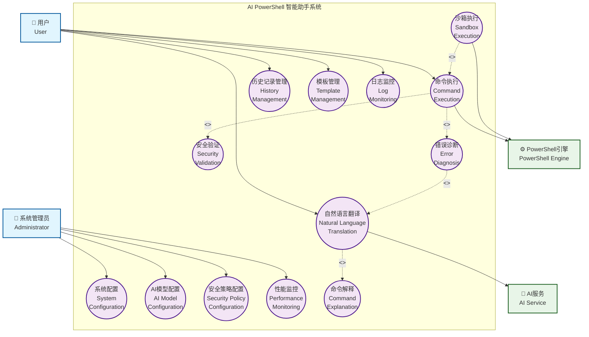

# AI PowerShell 智能助手 - 用例图

## 系统用例图

## 详细用例说明

### 👤 参与者 (Actors)

| 参与者 | 描述 | 主要职责 |
|--------|------|----------|
| **用户** | 使用系统的普通用户 | 输入自然语言、执行命令、查看历史 |
| **系统管理员** | 管理系统配置的管理员 | 配置AI模型、安全策略、监控系统 |
| **AI服务** | 外部AI模型服务 | 提供自然语言处理能力 |
| **PowerShell引擎** | 系统PowerShell环境 | 执行生成的PowerShell命令 |

### 🎯 核心用例 (Core Use Cases)

#### UC1: 自然语言翻译
- **描述**: 将用户输入的中文自然语言转换为PowerShell命令
- **参与者**: 用户, AI服务
- **前置条件**: AI服务可用
- **主要流程**:
  1. 用户输入自然语言描述
  2. 系统调用AI服务进行翻译
  3. 返回生成的PowerShell命令
- **包含**: 命令解释 (UC11)
- **扩展**: 错误诊断 (UC12)

#### UC2: 命令执行
- **描述**: 执行生成的PowerShell命令并返回结果
- **参与者**: 用户, PowerShell引擎
- **前置条件**: 命令通过安全验证
- **主要流程**:
  1. 接收PowerShell命令
  2. 进行安全验证
  3. 执行命令
  4. 返回执行结果
- **包含**: 安全验证 (UC5), 错误诊断 (UC12)
- **扩展**: 沙箱执行 (UC13)

#### UC3: 历史记录管理
- **描述**: 管理用户的命令历史记录
- **参与者**: 用户
- **主要流程**:
  1. 查看历史记录
  2. 搜索特定命令
  3. 重新执行历史命令
  4. 删除历史记录

#### UC4: 模板管理
- **描述**: 管理PowerShell命令模板
- **参与者**: 用户
- **主要流程**:
  1. 创建新模板
  2. 编辑现有模板
  3. 使用模板生成命令
  4. 分享和导入模板

#### UC5: 安全验证
- **描述**: 验证命令的安全性
- **参与者**: 系统
- **主要流程**:
  1. 检查命令白名单
  2. 验证权限要求
  3. 评估风险等级
  4. 决定是否允许执行

### ⚙️ 管理用例 (Administrative Use Cases)

#### UC6: 系统配置
- **描述**: 配置系统基本参数
- **参与者**: 系统管理员
- **主要流程**:
  1. 修改系统配置
  2. 设置日志级别
  3. 配置存储路径
  4. 调整性能参数

#### UC7: AI模型配置
- **描述**: 配置AI模型相关参数
- **参与者**: 系统管理员
- **主要流程**:
  1. 选择AI提供商
  2. 配置模型参数
  3. 设置API密钥
  4. 测试模型连接

#### UC8: 安全策略配置
- **描述**: 配置系统安全策略
- **参与者**: 系统管理员
- **主要流程**:
  1. 设置安全级别
  2. 配置命令白名单
  3. 定义危险模式
  4. 启用沙箱模式

### 📊 监控用例 (Monitoring Use Cases)

#### UC9: 日志监控
- **描述**: 实时查看系统日志
- **参与者**: 用户, 系统管理员
- **主要流程**:
  1. 查看实时日志
  2. 过滤日志内容
  3. 导出日志文件
  4. 设置日志告警

#### UC10: 性能监控
- **描述**: 监控系统性能指标
- **参与者**: 系统管理员
- **主要流程**:
  1. 查看CPU使用率
  2. 监控内存占用
  3. 统计响应时间
  4. 分析性能趋势

### 🔧 扩展用例 (Extended Use Cases)

#### UC11: 命令解释
- **描述**: 解释生成的PowerShell命令
- **参与者**: 系统
- **触发条件**: 自然语言翻译完成
- **主要流程**:
  1. 分析命令结构
  2. 生成命令说明
  3. 提供参数解释
  4. 显示预期结果

#### UC12: 错误诊断
- **描述**: 诊断和处理执行错误
- **参与者**: 系统
- **触发条件**: 命令执行失败或翻译失败
- **主要流程**:
  1. 捕获错误信息
  2. 分析错误原因
  3. 提供解决建议
  4. 记录错误日志

#### UC13: 沙箱执行
- **描述**: 在隔离环境中执行命令
- **参与者**: PowerShell引擎
- **触发条件**: 启用沙箱模式且命令风险较高
- **主要流程**:
  1. 创建隔离环境
  2. 在沙箱中执行命令
  3. 收集执行结果
  4. 清理沙箱环境

## 用例关系说明

### 包含关系 (Include)
- **UC1 包含 UC11**: 自然语言翻译总是包含命令解释
- **UC2 包含 UC5**: 命令执行必须包含安全验证
- **UC2 包含 UC12**: 命令执行包含错误处理

### 扩展关系 (Extend)
- **UC13 扩展 UC2**: 在特定条件下使用沙箱执行
- **UC12 扩展 UC1**: 翻译失败时进行错误诊断

### 泛化关系 (Generalization)
- 用户和系统管理员都是系统的使用者
- 不同类型的配置用例都继承自基本配置功能

## 用例优先级

| 优先级 | 用例 | 重要性 |
|--------|------|--------|
| **高** | UC1, UC2, UC5 | 核心功能，系统必须具备 |
| **中** | UC3, UC4, UC6, UC7 | 重要功能，提升用户体验 |
| **低** | UC8, UC9, UC10, UC11, UC12, UC13 | 增强功能，提供额外价值 |
